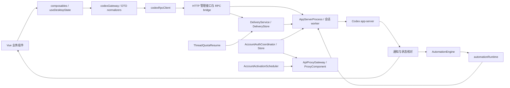

# CodexApp 0.2 版本模块说明

## 系统边界

CodexApp 是浏览器界面与主机 Codex app-server 之间的应用层。模型任务、文件、git 和终端执行在服务主机；浏览器拥有界面偏好和输入草稿，服务端拥有账号、任务计划、投递与历史状态。Vue 路由采用 hash，主要路由视图由 App.vue 根据路由组织，router 中的 EmptyRouteView 是当前架构适配，并非一组失效页面。

图中激活使用独立 API 请求路径，不通过普通会话发送队列；正因如此，发布活动检查需要额外覆盖它。图展示逻辑依赖，生产代码仍有大量装配集中在 bridge 内。

## 前端模块

| 模块 | 入口/主要文件 | 职责与边界 | 相关验证 |
| --- | --- | --- | --- |
| 应用壳与路由 | `src/App.vue`、`router/index.ts` | 布局、路由区、全局弹窗、账号/设置装配；大内容组件异步加载 | 首页 profiler、响应式用例 |
| 会话状态 | `composables/useDesktopState.ts` | 会话列表/选择、加载、发送、通知后的状态协调 | 同名单测、历史/发送用例 |
| API 领域适配 | `api/codexGateway.ts` | 封装业务接口、转 UI 结构、模型/目录/历史/队列调用 | normalizers、gateway 相关测试 |
| RPC 与通知 | `api/codexRpcClient.ts`、`api/appServerDtos.ts` | 方法请求、能力目录、通知订阅及协议类型 | RPC/生命周期测试 |
| 投递与模型 | `api/deliveryOutbox.ts`、`api/modelCatalog.ts`、`api/normalizers/` | 浏览器未确认发送、模型能力缓存、原生数据归一化 | outbox/model/normalizer 单测 |
| 项目/会话导航 | `components/sidebar/SidebarThreadTree.vue` | 项目与会话、操作菜单；当前还容纳自动化编辑表单 | 项目、自动化保存/刷新用例 |
| 会话显示 | `components/content/ThreadConversation.vue` | 消息、Markdown、计划、问题、历史、工具与错误展示 | 消息解析、TestChat、提问卡片 |
| 输入 | `components/content/ThreadComposer.vue` | 草稿、附件、技能/命令、发送快捷键、轻保存提示 | 草稿/IME/发送用例 |
| 自动化列表 | `components/content/AutomationsPanel.vue` | 搜索、开关、详情、手动运行、执行历史 | automation/time/历史用例 |
| 扩展目录 | `DirectoryHub.vue`、`SkillsHub.vue` 等 content 组件 | 技能/插件/应用/MCP 的列表与按需详情 | directoryPluginCache、目录用例 |
| 账号与设置 | `components/accounts/`、`components/settings/` | 账号卡片、连接、额度、通知、定时激活、默认偏好与外观 | 账号、通知、激活 UI 用例 |
| API 管理 | `components/api-proxy/ApiProxyPanel.vue` | API 设置、key、活动、用量视图 | API gateway/usage 测试 |
| 公共控件 | `components/common/`、`style.css` | Dialog、Popover、Select、Button、Switch、TimeInput、可关闭提示和主题 token | 公共控件、几何、时间校验 |
| 时间/语言/反馈 | `useUiLanguage`、`useQuotaClock`、`useFeedbackDiagnostics` | 翻译、共享时钟、最小报告；不拥有服务端任务执行 | 对应纯函数和 composable 测试 |

`ComposerDropdown` 是 AppSelect 的兼容包装；`ComposerSearchDropdown` 保留技能等多选/描述语义，不应强行当作普通单选。新弹窗和浮层直接复用公共组件。

## 服务端模块

| 模块 | 主要文件 | 状态所有者与关键责任 |
| --- | --- | --- |
| CLI/监听 | `cli/index.ts`、`cli/listenOnPort.ts` | 参数、端口、启动/退出；严格端口不可悄悄漂移 |
| HTTP/静态资源 | `server/httpServer.ts`、`frontendAssets.ts` | 管理入口、文件浏览/编辑、WebSocket 挂载、入口 no-store 和旧资源 404 |
| WebUI 认证 | `authMiddleware.ts`、`password.ts` | 登录 cookie、可信本机/网络判断；与 API key 分开 |
| 运行桥 | `codexAppServerBridge.ts` | RPC 装配、能力目录、app-server 生命周期、通知、会话 worker、多个管理路由；当前最大模块 |
| 历史/搜索 | `threadHistory.ts`、`threadSearch.ts`、`threadListCompatibility.ts` | 原生分页优先、有界兼容读取、正文搜索覆盖范围和缓存 |
| 目标/压缩 | `threadGoalReader.ts`、`threadCompactionGate.ts` | 观察原生目标、压缩能力和状态；不自行发明原生预算语义 |
| 完成/过程 | `threadCompletionList.ts`、`processActivityStore.ts` | 完成标记和 Hook 观察记录，标记清除需要匹配当前 token |
| 账号存储/协调 | `accountAuthStore.ts`、`accountAuthCoordinator.ts`、`accountTokenRefresh.ts` | 账号注册、固定身份、凭据版本、刷新与修改互斥 |
| 执行资源 | `accountExecution.ts`、`accountResourcePool.ts` | lease、移除撤销、忙碌优先级；有界 worker/component 池 |
| 自定义连接 | `customConnectionStore.ts`、`customConnectionProxy.ts` | 保存用户连接、协议/模型能力、Responses 请求适配 |
| provider 兼容 | `freeMode.ts`、`openRouterProxy.ts`、`zenProxy.ts`、`customEndpointProxy.ts`、`unifiedResponsesProxy.ts` | 现存 provider 路径与协议转换；仍在用，不能按旧命名删除 |
| 自动化定义/时间 | `automationDefinition.ts`、`automationSchedule.ts`、`automationTime.ts`、`automationDailyTimes.ts` | TOML、受支持 RRULE、调度时区、成对每日时刻 |
| 自动化引擎 | `automationEngine.ts`、`automationRuntime.ts` | 定时/手动领取、四槽调度、账号申请、提交、通知和状态核对 |
| 自动化存储/历史 | `automationStore.ts`、`automationHistory.ts` | 单写者租约、hot state、按任务冷归档、request key 索引 |
| 消息投递 | `deliveryService.ts`、`deliveryStore.ts`、`deliveryHistory.ts` | 排队、revision、发送前记账、receipt、未知结果核对 |
| 额度续跑 | `threadQuotaResume.ts` | 续跑意图、等待额度、创建稳定投递 ID；提交仍经 DeliveryService |
| API 出口 | `apiProxy/gateway.ts`、`component.ts`、`store.ts`、`activity.ts`、`usage.ts` | key、HTTP/SSE/WS、固定账号 generation、drain、用量与并发 |
| 账号定时激活 | `accountActivationScheduler.ts`、`Admission.ts`、`Runtime.ts`、`Request.ts`、`History.ts`（同前缀） | 日历计划、双重准入、最小 API 请求、claim 与历史；默认关闭 |
| 额度通知 | `accountNotificationService.ts` | 周期额度观察、恢复/重置提醒、免打扰、POST 领取与结果 |
| Telegram | `telegramThreadBridge.ts`、`telegramNotificationQueue.ts` | 配置、会话映射、轮询、独立渠道通知与免打扰 |
| 文件/项目/git | `localBrowseUi.ts`、`projectDirectories.ts`、`reviewGit.ts` | 文件展示/编辑、项目 AGENTS 受管块、变更查看和明确 git 操作 |
| 终端 | `terminalManager.ts`、`backgroundTerminalReader.ts` | App 内交互 PTY 与原生后台终端分别管理；processId 不是 OS PID |
| 发布 | `scripts/codexapp-release-switch.sh`、`check-codexapp-idle.cjs` | prepare/check/activate/rollback、本机生产边界与交接证据 |

旧 `accountActivationSession.ts` 及其专用测试已在 0.2.19 移除；现行最小 API 激活由 `accountActivationRuntime.ts` 承担。此次只删除确认无业务引用的实现，保留原生会话管理模块。

## 四条关键工作流

### 用户发消息

输入框草稿 → 前端未确认发送标记 → gateway 提交 deliveryId → DeliveryStore 持久 queued/sending → DeliveryService 校验上下文与 revision → worker `turn/start` → receipt/原生通知 → UI 更新。请求超时不能证明未发送；unknown 要核对。前端草稿与服务端投递台账不可合并成同一个成功标识。

### 自动化

读取 `automations/<id>/automation.toml` → 计算定义 revision 和下次时点 → 每秒 tick 领取 → 写 queued/starting → 获取固定账号与目标会话 → 写 submittedAt → `turn/start` → 通知或每 30 秒核对 → 终态 → 归档。定义约每 60 秒扫描，租约约每 30 秒续期；保存接口可主动 refresh。

0.2.19 的定期 inspect 在串行控制区外等待，最多四个未结束的底层检查，同一 run 只允许一个。检查持有克隆快照，回写核对归属、revision、状态与通知版本；完成/取消/审批之后的旧快照不得覆盖。手动控制及其他账号可用槽位不等待该查询。账号准备链的硬超时仍未实现。

会话自动化 heartbeat 推进指定会话；项目 cron 按执行目录创建会话。忙碌与审批影响能否发起，不在 WebUI 打开时才运行。多次漏跑合并最近时点，超过 24 小时的最近漏跑记 missed；同目标已有 queued 时合并，不产生无界补跑。

### 账号激活

每 10 秒 tick → 选择未来每日时刻，无启动补跑 → 按账号持久 claim → busy/新额度检查 → 持有固定 generation → 再核对状态与 credentialRevision → 最小请求 → 释放 → 可选额度同步 → 记录 sent/skipped/unknown。前台/API/自动化占用可中止可选激活；返回 sent 只说明请求完成，五小时窗口是否启动需要额度事实。

### 发布

提交源码 → build → pack → 新目录安装 → 组件校验 → CLI/PTY/真实包缓存验收 → 精确路径交接。未来授权激活时需 drain/idle 后才停服务、保留认证回退信息并切换；本次停在 prepare。0.2.19 已补充发布专用 activation/drain 与只读 activation/activity；活动覆盖迟到准备与清理，冻结失败需解除。旧实例不支持活动接口时必须明确标记 unsupported，不能解释成零。详见[0.2.19 收口验收](20260912-0014-codexapp-0.2.19稳定性收口与验收.md)。

## 持久化归属

以下路径均相对**实际实例的 CODEX_HOME**，不得在候选中默认指向生产：

| 数据 | 路径/位置 | 写入者与注意事项 |
| --- | --- | --- |
| 账号/凭据 | `auth.json`、`accounts.json`、`accounts/` | AccountAuthStore/Coordinator；私有，不进入报告或公开包 |
| 自动化计划 | `automations/<id>/automation.toml` | 计划管理入口；保留未识别的扩展字段 |
| 调度 hot state/租约 | `codexapp-automations/state.json`、`scheduler.lock/` | AutomationStore；损坏停止执行 |
| 自动化历史/索引 | `codexapp-automations/history/`、`history-keys/` | AutomationHistory；长期未设保留上限 |
| 发送队列/receipt | `codexapp-delivery/pending.json`、`codexapp-delivery/receipts/` | bridge 装配 DeliveryStore，业务写入统一经 store；不直接编辑 |
| 额度续跑 | `codexapp-quota-resume.json` | ThreadQuotaResume；重启 submitted 先变 unknown |
| 激活计划/历史 | `account-activation/state.json`、`history/`、`writer/` | AccountActivationScheduler；历史按日期保存，保留约三个月 |
| 通知 | `account-notifications/` 与 Telegram 配置/队列 | 各渠道服务管理，失败不保存远端敏感响应 |
| API | `api-proxy/` | ProxyStore/usage/component；不公开 key 或投影凭据 |
| 完成标记 | `codexapp-thread-completions-v1.json` | ThreadCompletionList |
| Hook 观察 | `codexapp-hook-observations.json` | ProcessActivityStore；不代表所有历史执行 |
| WebUI 登录 | `webui-auth-sessions.json` | authMiddleware，保存会话 token，不是 Codex 账号 |
| 浏览器偏好/草稿 | 当前来源 localStorage | 前端对应 composable；按浏览器/端口分开 |
| 项目目录上下文 | 项目内 AGENTS.md 的受管标记块 | projectDirectories；保留用户其他内容 |

定位实际文件时先看构造调用的 directory，不凭概念名称猜测磁盘位置。历史/工作目录/账号目录不能互相替代；SQLite/WAL、缓存和日志变化也不能直接判定为认证变化。

## 维护时从哪里开始

| 需求 | 首先查看 | 同时核对 |
| --- | --- | --- |
| 消息重复、发送未知 | deliveryService/store/outbox | worker clientId、通知与上下文变更 |
| 自动化没运行 | automationEngine snapshot、definition、schedule | queued/starting、账号准入、lease、SCH-02/03 |
| 每天多个时间 | automationDailyTimes、automationSchedule | 编辑器与 TOML 往返、DST、旧版降级 |
| 定时激活影响前台 | ActivationAdmission/Runtime、execution registry | generation 引用、账号忙碌、SCH-01 |
| 页面慢/重复请求 | profiler → codexGateway/useDesktopState/App | apiSummary 全项、订阅、缓存失效 |
| UI 调整 | 业务组件 → common primitive → style.css | 浅深/窄屏、键盘、保存失败与刷新 |
| 删除冗余 | 严格 unused 诊断 + 全仓引用/构建图 | 公共导出、运行时方法名、兼容入口与测试 |

此轮结构审阅建议按领域渐进抽出大模块，保留适配接口。[编码规范](20260912-0007-codexapp-0.2版本编码规范.md)定义后续改动边界，[审阅报告](20260912-0006-codexapp-0.2系统代码审阅.md)列出尚未整改的具体问题。

## 0.2.19：侧栏暂留与未处理问题

`activeSidebarSession.ts` 仅保存本次活跃筛选的会话 ID，关闭筛选清空，阅读并切走后移除已结束行，不写运行或未读状态。`threadInterruptionList.ts` 保存最终非手动异常的 threadId/turnId/种类，`useThreadInterruptions.ts` 复用侧栏既有通知订阅同步摘要；不进入账号选择、额度调度、投递与重试链。

问题记录为 `codexapp-thread-interruptions-v1.json`，忽略继续使用 `ignored-quota-errors.json` 及原 API，扩展到普通最终错误。阅读不清理问题，忽略可撤销，新问题不受旧回合标记影响。中断筛选复用摘要，对尚未发现的旧会话按需读取最后回合元数据；不全量扫描历史。
