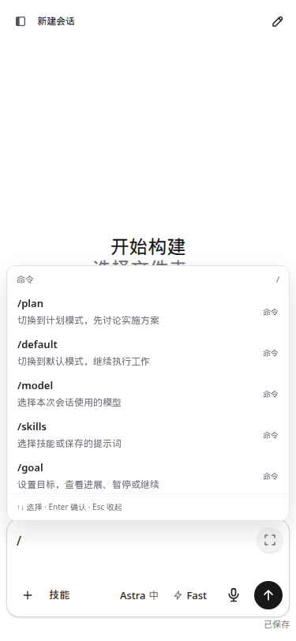
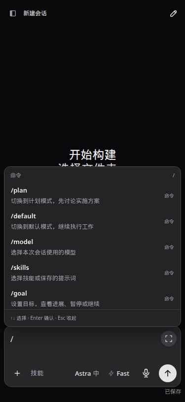
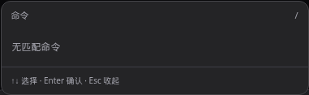

# 0.2.19 稳定性收口与验收

以 `136a6c3`（含用户追加的提示动画、侧边栏和命令搜索 UI 修改）为基线，在 `feature/0.2.19-stabilization` 上实施。运行代码提交为 `3a9b9e1391b7`，其后仅补充验收脚本、证据和文档。2026-09-12 已将独立开发实例 59001 更新为 0.2.19；753 项测试通过，构建、类型检查、安装包和界面验收通过。

生产 5900 仍运行 0.2.18；本轮未执行生产 activate。所有测试结论均有范围：本轮使用模拟 runtime 验证账号与出口的相互阻塞，没有向真实云账号发送测试请求，不能将测试通过解释为真实账号全组合验收或不存在任何调度风险。

## 核心契约与实施取舍

账号选择、固定出口与默认出口的差别、切换/刷新/移除的阻塞范围、额度保护与刷新规则、自动化并发四槽、同会话占用、API HTTP/SSE/WS 及续接归属、发送去重和不确定结果不自动重发、自动激活向同账号正常工作让出，沿用现行规则。没有修改 `accountAuthCoordinator.ts`、`accountExecution.ts` 或 bridge 中账号选择与 worker 路由的业务实现；`accountTaskRouting.test.ts` 是相关回归文件。

发布冻结是部署专用的短暂准入状态，独立于普通账号切换和 API 设置；不能把它复用成全局账号锁。用户已明确核心功能优先，允许保留部分不安全因素，因此本轮不通过扩大认证、来源限制、强杀共享 worker 或清理历史索引来完成审阅清单。

## 已实施

| 项目 | 具体行为 | 边界与证据 |
| --- | --- | --- |
| `/` 开头触发 | 只有草稿字符 0 开始的命令打开搜索；正文、空白后、后续行及路径中的 `/` 按字面保留 | 原有发送、Esc、粘贴规则保留；命令模块 21 项测试及实际 59001 界面验收 |
| 空结果文案 | 中文“无匹配命令”，英文“No matching commands” | 不再显示继续输入或发送的说明 |
| SCH-01 激活发布门禁 | 增加只读 `/codex-api/api-proxy/activation/activity` 和发布专用 `/activation/drain`；发布、回退和候选替换脚本在停止服务前冻结新激活 | 普通账号/API 操作不设置此冻结。后台准备、发送、额度核对和迟到清理均纳入活动统计；外层超时不能假装底层已结束 |
| SCH-01 异常恢复 | 冻结请求发出前记录回退责任；响应丢失或部署失败时解除冻结；idle check 对未知状态拒绝放行 | 旧版本 404 显示 unsupported，不解释为零活动。此次从旧开发实例迁移前另行确认自动激活关闭、账号列表为空，并两次完成空闲检查 |
| SCH-02 慢检查隔离 | 定期 inspect 在调度串行区外等待，完成后以 run/revision/状态/归属及事件版本核对再提交 | 迟到 running 不覆盖完成、取消或审批；不会复活旧任务、重复释放或打断另一个账号。运行任务仍最多四个 |
| SCH-04 续跑公平性 | waiting 与 unknown 各自保存内存游标，每批最多八条轮转 | 前八条长期忙时尾部也会轮到；每轮最多一次真实提交，额度准入、会话占用与 unknown 不重发规则保留 |
| RED-01 已确认退役代码 | 删除无业务引用的 `accountActivationSession.ts` 及仅服务该旧实现的两个测试文件 | 当前 `accountActivationRuntime.ts` 的最小 API 激活实现保留；未删除用户会话、激活历史或其他可疑未用模块 |
| REL-01 运行依赖记录 | 将 9 个直接运行/可选依赖固定到原已安装版本；prepare 安装时保留该目录的 `package-lock.json` | 没有升级依赖。按锁文件 `npm ci --omit=dev` 复装后，78 个运行依赖版本一致，锁文件未变，PTY 再次通过 |

## 暂缓项目与剩余风险

| 项目 | 本轮决定 | 仍可能出现的情况 |
| --- | --- | --- |
| SCH-03 账号准备截止时间 | 暂缓强制超时；需要准备链全程取消及资源所有权设计 | 共享 worker 的 read/configure/账号准备若永不返回，仍可能占用对应执行槽；不能仅 Promise.race 后释放槽或杀共享进程 |
| SEC-01 主动 HTML 预览隔离 | 保留已知边界，留待独立来源/权限模型设计 | 不可信预览内容仍可能通过同源能力访问本机接口；此次没有扩大 CSP/CORS/认证限制，也未宣称此风险已修复 |
| MOD-01 大模块拆分 | 留待 0.3 | 模块耦合与维护成本仍在，避免收口版本大范围搬移核心调度代码 |
| PERF-01 跨页面重复读取/缓存 | 不合并跨账号共享缓存 | 原有重复读取或慢提供商请求仍可能存在；避免引入账号身份、额度失效和出口归属混淆 |
| DATA-01 历史与防重索引 | 不清理 | 长期增长问题仍在；清理前需要验证 delivery/receipt 幂等索引的保留窗口 |
| RED-01 其他未用候选 | 不按静态名单批量删除 | 本轮只移除确认无入口的旧激活实现，保留其他模块供后续逐项判断 |
| REL-01 最低 Node 版本 | 仅验证本机 Node v24.19.0 | package 声明仍为 Node >=18；不能据此宣称所有最低版本环境已验收。不同 prepare 的间接依赖仍可能变化，精确复装以该准备目录锁文件为准 |

慢 inspect 的隔离有明确上限：最多四个尚未结束的底层查询，外层 30 秒超时后仍保留占位，防止下一轮堆叠调用。若四个底层查询永久挂住，后续查询也可能等待；通知、手动控制和已可用任务槽的调度不因此进入同一个等待队列。启动恢复以及其他准备链不属于此次 inspect 隔离的完整修复范围。

## 账号与出口保护矩阵

以下为源码路径和模拟 runtime 的回归结果；没有真实云调用。

| 场景 | 验证结果 |
| --- | --- |
| 切换默认账号时已有固定账号长流 | 固定账号流继续；默认出口仍按原规则拒绝/关闭，恢复后可再准入 |
| 发布专用激活冻结与正常固定账号请求 | 冻结可选激活时正常固定账号请求仍可接受，未设置普通 API 的全局 draining |
| A 账号检查缓慢，B 账号新自动化 | B 可利用空闲槽发起；移除 A 仅取消 A 的任务，B 继续，未发生额外 interrupt |
| 检查期间到达完成/取消/审批通知 | 迟到旧快照被拒绝，不覆盖新状态，不重复释放 |
| 一账号刷新/移除与另一账号执行 | 原有 coordinator、runtime integration、gateway 相关测试通过，阻塞范围保持按账号区分 |
| 正常工作与可选激活 | 同账号正常工作优先；激活 busy/5 小时额度准入及固定凭据规则保留 |
| 投递结果不确定、重复提交、额度续跑 | 原 delivery/receipt 去重、unknown 核对和额度保护测试通过；尾部轮转不增加提交上限 |
| 发布冻结失败或响应丢失 | 候选替换中止、旧实例不停止；冻结解除。真实生产 activate/rollback 本轮没有执行 |

## 验证命令与结果

| 检查 | 命令/证据 | 结果 |
| --- | --- | --- |
| 基线 | `pnpm exec vitest run --maxWorkers=4 --reporter=json --outputFile=output/0219/baseline-results.json` | 738 passed、1 skipped；无完整摘要的默认并发输出不作验收 |
| 全量回归 | `pnpm exec vitest run --maxWorkers=4 --reporter=json --outputFile=output/0219/final-results.json` | 753 passed、0 failed、0 skipped；旧实现的 1 个测试和 1 个 opt-in skip 随退役文件移除 |
| 类型检查 | `pnpm exec vue-tsc --noEmit` | 通过 |
| 构建与脚本 | `pnpm run build`；两个部署脚本 `bash -n`；`git diff --check` | 通过；CLI 952.21 KB |
| 公共 CJS 导出 | `node -e "const {checkIdle}=require('./scripts/check-codexapp-idle.cjs'); if(typeof checkIdle!=='function') process.exit(1); console.log('IDLE_CHECK_CJS_OK')"` | IDLE_CHECK_CJS_OK |
| 实际准备包 | `node scripts/audit/0.2.19-package.cjs`（首次从相同内容的 `output/0219/package-smoke.cjs` 执行） | 27 个 dist/dist-cli 文件逐字节一致；express、ws、node-pty CJS 导出正确；原安装与锁文件复装均输出 PREPARED_PTY_OK |
| 缓存迁移 | 59015，独立临时 home，同一浏览器从旧 0.2.18 切到准备包 | 刷新加载 0.2.19；入口 no-store、无 ETag/Last-Modified；旧资源 404，新资源 immutable；无密钥 API 401 |
| 开发界面 | `UI_BASE_URL=http://127.0.0.1:4173 UI_LABEL=dev node scripts/audit/0.2.19-slash-ui.cjs` | 7 类字面前缀、开头命令、Esc、中文/英文空结果通过，未发送回合 |
| 候选界面 | `UI_BASE_URL=http://127.0.0.1:59001 UI_LABEL=candidate node scripts/audit/0.2.19-slash-ui.cjs`（首次从 output 执行；补充空结果局部截图后使用归档脚本复验通过） | 1440×1000、375×812、768×1024，各浅/深主题通过；无页面错误，turn/start 为 0 |

[测试摘要](assets/0.2.19-stabilization/tests-summary.json)、[准备包验收](assets/0.2.19-stabilization/prepared-verification.json)、[候选更新](assets/0.2.19-stabilization/candidate-deployment.json)、[界面断言](assets/0.2.19-stabilization/slash-candidate-ui.json)保留可复查结果。完整日志位于项目 `output/0219/`，均未进入发布 tarball。

## 性能核对

- `/` 匹配只扫描光标前字符串一次；正文非 `/` 开头立即不匹配，没有增加 RPC、轮询或订阅。只影响搜索框触发和本地文案。
- inspect 每 30 秒检查的周期保留；最多四个底层查询，同 run 不叠加，结果落盘仍串行。慢查询不再阻塞手动控制、通知和可用槽位调度；不是扩大并发换取响应。
- 额度续跑新增两个内存游标，每状态最多八条，每轮最多一次发送，没有新增持久字段或定时器。
- 激活活动计数跟随原有 promise 清理；发布预检增加两次只读活动请求，不加入普通 API 请求路径。正常账号准入没有新增全局锁。
- `PROFILE_BASE_URL=http://127.0.0.1:4173 PROFILE_WAIT_MS=7000 PROFILE_BROWSER_EXECUTABLE=/snap/bin/chromium pnpm run profile:browser` 实测：API 总响应 15.2 KB；thread/list、skills/list、额度和模型各 1 次；thread/resume、完整 thread/read 为 0。提供商模型请求约 1070.9ms，有慢请求警告，未称全部无警告；这次没有对应旧版本同条件性能样本，不能声称量化提速。
- [性能摘要](assets/0.2.19-stabilization/browser-performance-summary.json)；原 trace `/home/Code/codexapp/output/playwright/browser-runtime-profile-home-2026-09-12T15-01-28-359Z-trace.zip`。本轮未测真实云账号吞吐或长时间生产负载。

## 59001、prepare 与生产状态

准备目录：`/home/docker/codexapp-releases/codexapp-0.2.19-3a9b9e1391b7-20260912-225317`。

包文件 `/tmp/codexapp-0.2.19.tgz` SHA-256：`fae7b384a5f5e6aa9e857b8aac1d2a91d940720c3f61d204b2943b80d9a13a7c`。

准备目录锁文件 SHA-256：`99b8a108e23f54fc1176430f6ac46196bbdebcdaeec6405f6d6caa73d7a42ded`。恢复该目录的依赖使用其自身的锁文件，不用另一批 prepare 的锁替换。

59001 服务为 `codexapp-dev-59001.service`，运行 `/home/Code/codexapp/dist-cli/index.js`，沿用独立 `CODEX_HOME=/home/docker/codexapp-dev-0218/codex-home`；历史目录名保留，未迁移账号或会话。更新前先确认自动激活关闭，再冻结开发实例自动化/API 并复查空闲；重启后确认 0.2.19、解除冻结且 activation/activity 为 ready、非 draining、activeCount=0。队列、回合、审批、API 请求/连接和后台终端均为零。

生产 5900 的 PID 在本次开发更新前后仍为 `4010970`，认证文件校验仅记录“相同”，不记录认证内容或其摘要。实际运行目录仍为 `/home/docker/codexapp-releases/codexapp-0.2.18-6ad0e99242c8-20260912-221253`。59015 的测试浏览器、进程和临时 home 已清理；4173 验证服务按约定保留。

如需回退 59001，只在重新通过该实例空闲检查后，使用保留的旧准备包和同一独立 home 恢复；不能向生产 home 复制候选状态。生产切换需要另外授权，并在独立终端对上述精确准备路径执行 check；当前开发会话中的生产工作不应为切换而中止。

## 界面截图

测试 URL：`http://127.0.0.1:59001/#/`；视口：1440×1000、375×812、768×1024；每种视口检查浅/深主题、真实菜单越界、Esc、字面斜杠及空结果文案。截图保存前等待约 2.3 秒。

完整截图绝对路径采用 `/home/Code/codexapp/output/playwright/0219-slash-candidate-{1440,375,768}-{light,dark}.png`；空结果为 `/home/Code/codexapp/output/playwright/0219-slash-empty-candidate-{light,dark}.png`。包含侧栏账号/会话信息的桌面全屏截图仅保留在本机输出目录；文档仅附无侧栏个人信息的手机图与菜单局部截图。局部截图绝对路径为 `/home/Code/codexapp/output/playwright/0219-slash-empty-detail-candidate-light.png` 和 `/home/Code/codexapp/output/playwright/0219-slash-empty-detail-candidate-dark.png`。

