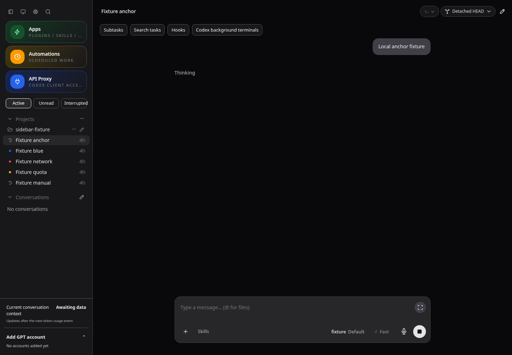
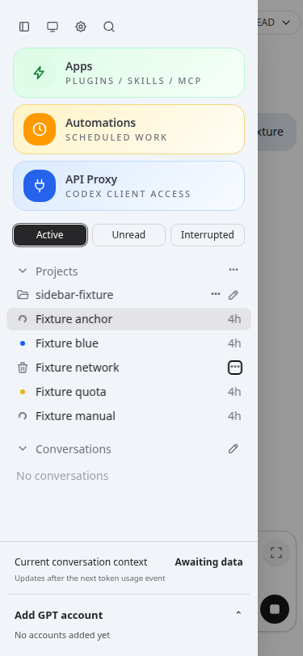

# CodexApp 0.2.19 最终收口开发与验收

依据 [0.2 长期定型方案](20260912-0016-codexapp-项目主导0.3与0.2收口取舍.md) 和本轮用户授权推进。59001 使用独立 CODEX_HOME；生产 5900 继续原 0.2.18。prepare 不等于生产激活。用户要求核心账号切换、调度、用量、API、出口与互相阻塞语义优先，任何回归都必须修复或撤回。

## 本轮范围与当前状态

| 范围 | 实施边界 | 状态 |
| --- | --- | --- |
| 已审核通知文案 | 1,044 行中 60 行有明确意见；只改这些正文及对应翻译，保留模板变量、错误码和业务保护 | 已提交 b824bb5；组合验收继续 |
| 无目录项目（用户追加，优先） | 只填名字创建；独立 UI 组织元数据，闭合/展开层级图标；不创建项目文件夹，不改真实会话工作目录、账号或文件；不增加解释性提示 | 已实现；项目 HTTP/IPC、浏览器明暗中英文与全量 766 项通过 |
| 自动化页面两侧留白（用户追加） | 窄屏保持至少 12px 外侧间距；只改布局 | 已提交 b90265c；6 尺寸 × 明暗边界测量通过 |
| 引导消息可见性（用户追加） | 操作即时反馈、队列持久状态、切换/刷新/重连及迟到回执；不改变发送与账号阻塞 | 已实现；782 项组合回归、116 项最终定向回归与浏览器故障/切换/刷新通过 |
| 活跃暂留与问题圆点（用户追加） | 活跃按本次筛选周期暂留；红/黄点是独立持久问题，阅读不清除，手动忽略及中断筛选兼容 | 已实现；793 项组合回归、26 项最终定向、18 项实际 HTTP/账号/自动化回归及三视口明暗浏览器通过 |
| SCH-03 | 准备期限、取消与迟到效果的真实 adapter 所有权；保持四槽和既有账号规则 | 已实现；66 项调度/账号/准备回归通过，真实 PID 回收和共享会话保留均有证据；全批打包验收继续 |
| SEC-01 | 验证兼容的主动预览隔离；不能破坏现有核心工作流 | 实际浏览器验证完成；依用户功能优先授权保留现有手动预览风险，未加破坏性 CSP |
| DATA-01 | 分段、旧格式兼容、恢复、防重事实永久保留 | 已实现；46 项历史/调度回归、五阶段真实 SIGKILL 恢复及离线兼容导出通过 |
| PERF-01 / MOD-01 | 只处理具体重复读取、失效和上述必要模块边界 | 已核对；项目缓存失效已修复，首页 15.3KB 无失败请求，必要同步保留；只抽取本轮局部模块 |

## 无目录项目契约

`codexapp-projects.json` 由 CodexApp 管理，版本 1 保存稳定项目 ID、名称及会话 cwd 的展示归属。cwd 仅作原生会话（含同 cwd 分支）的归组键，不能用组织 ID 作为执行 cwd。会话 ID、回合 ID、实际路径、账号执行租约和已保存内容继续由原生会话与既有账号代码管理。

- 仅创建、改名、排序、归组、移除组织时，只修改 CodexApp 元数据；不创建项目目录，不改 AGENTS.md，不搬动或重写会话文件。移除组织后会话回到无项目列表。
- 新建会话沿用现有无项目会话目录分配器，再登记展示归属；每次仍取得独立的普通无项目工作目录。项目名不会注入提示词、权限或工作规则。
- 项目自动化保留默认/固定账号、额度保护和出口选择；仅在新会话创建边界将组织目标解析为普通无项目会话目录。组织 ID 不进入原生 RPC 的 cwd。
- 文件浏览仅列出成员已有目录的链接。显式导出收集成员文件和会话；显式导入使用现有会话导入规则创建独立副本，并恢复组织关系。导入导出行为不等于创建组织时建立目录。
- 无项目工作目录本身如有 Git 或终端，仍按该会话原目录运行；组织自身不伪造 Git 根或共享工作区。
- 旧目录项目沿用原绝对路径、附加目录、Git/worktree、克隆及 ZIP 格式。新增元数据与原生工作区根列表分开。

## 已取得的阶段证据

这些是阶段结果，不能作为最终全批完成声明。

- 第一批项目/既有状态/自动化回归 113 项通过；新增真实 IPC 项目自动化与账号路由组合 19 项通过，包含默认账号、固定账号、手动/定时、拒绝后显式重试与原 auth 不变。
- 真实 HTTP 项目组织脚本验证空目录输入、同名项目、改名、归组、原会话字节不变、无 AGENTS.md、文件浏览、空/非空 ZIP、导入、进程重启和移除后原数据保留。脚本使用独立 home，清理仅限自己创建的测试目录。
- 原项目 HTTP 脚本（含真实 GitHub clone）通过，普通目录与文件内容保留。
- 缓存专项及既有桌面状态 71 项通过：排序提交不覆盖服务端组织元数据；并发读取合并，失效前的迟到响应不能恢复旧缓存。
- 浏览器项目及留白验证通过：无目录创建、展开/收起图标、改名、归组、刷新、新会话、自动化目标、删除后恢复无项目列表；6 尺寸 × 明暗最小间距 12px，中英文编辑器在桌面/平板/手机均通过。模拟 API 与真实 HTTP/IPC 证据分开。
- 全量单元回归 766 项通过；最后 ZIP 路径别名补充后 17 项定向回归及真实 HTTP 再测通过。构建、类型检查与 `node -e "process.argv=['node','codexapp','--help'];require('./dist-cli/index.js')"` 通过。
- 项目性能核对：组织映射按成员和会话线性遍历；目录浏览/ZIP 按用户操作读取，ZIP 沿用流式传输；状态读取复用并发缓存，排序失效不会吞掉元数据。不触发账号切换、投递或后台目录扫描。未以模拟浏览器测量冒充真实账号负载。

## 引导可见性阶段验收

正文现在显示提交中/等待引导/引导中/待确认/发送前失败/已送达/已移除；跨会话、刷新及双接口读取失败时仍保留内容。浏览器 outbox 接收确认后先保存显示记录，再清掉已确认的提交；队列项消失时仅 GET 已存在回执，不启动投递或核对 RPC。同文不同 ID 不合并；原生 ID 或已确认回合和序号决定替换。停止跟踪不冒充任务已中止。

浏览器 1440×1000、768×1024、375×812 明暗主题与 TestChat 链接三项断言通过；模拟请求的账号和执行边界另由真实 adapter 单测验证。前端投影 5,000 历史 + 100 显示记录，100 次采样中位 0.30ms/p95 0.50ms；无待显示记录时复用历史数组。阶段全量 782 项通过，最后补齐位置恢复和缓存失败覆盖后的定向 116 项通过。

## 最终验收门槛

完成所有本轮代码后，核对全量回归、构建/类型检查、打包安装/CJS/真实 PTY、真实本地 IPC/HTTP、浏览器明暗及手机/平板、故障恢复、性能数据；补全下列路径的最终结果与失败处理。对于未经过真实云账号/上游服务验证的部分明确边界，不以 fixture 成功冒充云端实测。

阶段原件：`output/0219-final/`；浏览器截图：`output/playwright/0219-*`。最终摘要与必要截图将随本页归档，并同步 Obsidian，核对两份一致。

## 活跃暂留与问题圆点阶段验收

活跃筛选只保留本次开启期间观察到的运行会话；结束/手动停止后仍在列表，查看并切走后移除。关闭再开启或刷新重算，历史蓝点不参与初始纳入。暂留是前端会话 ID 集合，不修改运行状态、未读台账或账号队列。

红黄点与阅读分开：后端记录最终异常的 ID/种类，额度黄点优先于普通红点；阅读、成功新回合不清理，手动忽略按原 threadId + turnId 机制生效且可撤销。正文普通最终错误增加同款忽略按钮，会话菜单提供“忽略全部问题”，只处理点击时已有的 ID。中断筛选复用未处理问题，旧历史仍按需读取最终回合，不启动全历史扫描。

问题摘要 GET 无原生 RPC，复用既有侧栏通知订阅：首次 ready 一次、重连一次，后续只推送变化。忽略只写 UI 元数据，不调整额度续跑开关，也不调用账号登录、投递或中断。活跃集合核心更新在 5,000 会话、100 次浏览器采样下中位约 0.20ms、p95 约 0.60ms（不含 Vue 渲染/上游网络）；重连必要读取保留。

浏览器证据：`http://127.0.0.1:4173`、1440×1000 / 768×1024 / 375×812 浅深主题，截图 `output/playwright/0219-sidebar-active-{light,dark}.png` 及 `0219-sidebar-active-{768,375}-{light,dark}.png`。已覆盖结束/手动停止暂留、阅读后切走、筛选重开、刷新后红黄点、忽略/撤销、保存失败、手机侧栏重挂载和菜单边界；模拟接口未执行真实 turn/start、turn/interrupt 或账号登录。全量 793 项通过，最后原生 systemError 补充后的定向 26 项通过，类型检查与构建通过。

归档截图（其余视口与摘要见 `assets/0.2.19-final/sidebar-verification.json`）：

## SCH-03 阶段验收与明确边界

准备默认总期限 90 秒，取消检查贯穿读取、账号获取、原生初始化和提交前准备。读超时仅结束调用者等待，实际 RPC 槽位保留；重复准备共享未结束的同类读取，每个进程最多四个，不缓存已完成结果。已发出的效果仍等待真实完成；本次新建进程可关闭并确认退出，已有共享进程不能被准备超时强杀。

66 项组合回归通过，包含实际本地 IPC：四个新准备 worker 在登录确认处挂起，超时后核对 PID 退出再释放，另一个普通会话继续运行；共享原生进程登录挂起则保留同会话阻塞与账号租约，独立会话可运行，确认返回后恢复；五次共享读取超时只保留一个真实 RPC；迟到额度和会话命名不产生投递；heartbeat 目标不清空。取消显示即时，但 activeCount/交接活动保留到效果与清理完成，第五个任务此后才可进入。

保留边界：共享进程内已发出且原生不支持取消的操作，仍需等它返回或由原所有者显式关闭。可能因此继续占用名额；没有用强杀、提前释放或重发冒充恢复。构建/类型检查通过；最终包、代理及整体回归仍在本批最后验收。

## DATA-01 阶段验收

新归档按任务和 UTC 日期分段，永久事实以请求键散列双份保存；pending 记录完整运行，恢复不会重新提交。旧格式正文与索引兼容读取、原件保留；旧索引指向已丢失正文时明确拒绝，修复了旧逻辑把此情况当作新请求的风险。派生索引可离线重建，旧应用回退前必须用当前包显式 `automation-history --home <目标 home> --export-legacy`；命令与历史恢复均检查调度锁。

46 项历史/引擎测试通过，另有五个原子写入位置的真实子进程 SIGKILL 验证：重启恢复单一原运行，旧算法可读取导出副本，认证哨兵不变。全量首轮 811 通过、1 项测试时序失败；共享读取的 100ms 测试期限误含进程启动，改为直接测试共享读取后该组 5 项通过，最后继续跑全量。

1,000 条/100 天：归档 1.19 秒；50 次采样，100 条分页中位 7.00ms/p95 7.95ms，键查询中位 0.10ms/p95 0.19ms，只驻留 11 个日索引，上限 32。原件见 `output/0219-final/history-performance.json`。首次旧格式迁移逐条复制，可能延长自动化初始化；未测 NAS 大规模历史或突然断电，同时丢失全部事实仍需备份恢复。这些边界没有用删除历史或提前放行旧请求规避。

## SEC-01 决定与证据

真实隔离服务器路由 + Chromium，1000×700：默认模式与 sandbox allow-scripts allow-same-origin 中，ES 模块、相对 JSON、实际文本 PUT 保存成功，HTML/SVG 同源管理 GET 也成功；sandbox allow-scripts 中三项兼容功能均失败，管理响应不可读。子资源不由自动化 fulfill，避免绕过浏览器 CORS；Ace 以离线 API 替身加载，实际保存接口不替换。没有向真实账号或管理数据发送写请求。

按用户允许保留风险以维护功能的授权，当前手动预览维持现状；没有声称完成独立来源隔离，也不把 sandbox 等同完整 CSRF 防御。0.3 扩大内嵌/自动主动预览前必须解决来源与能力边界。本轮不叠加临时 header 例外，不改全局管理认证或 API key。证据 `assets/0.2.19-final/preview-isolation.json`，截图记录临时测试 URL、视口及通过断言。

## 已完成的组合结果（继续追加封测修订）

- 全量 **812 项通过，0 失败、0 跳过**。实际本地 IPC 包含 accountRuntimeIntegration、automationDispatchIntegration、automationPreparationIntegration、providerResumeMatrix（七种出口两两 49 对，恢复/分支/隐式恢复），而不是只 mock 账号选择。
- `pnpm run build` 与公共 CJS help 通过；prepare 固定产物为 `/home/docker/codexapp-releases/codexapp-0.2.19-b1d8034121c4-20260913-023112`。27 个 dist/dist-cli 文件与本次构建一致；78 个运行依赖通过锁文件重装核对；安装产物和 npm ci 副本各执行真实 PTY，均输出 PREPARED_PTY_OK。内置 CLIProxyAPI 7.2.152 验证通过。
- 独立 59015 从旧包切新包：入口 no-store、无 ETag、旧 JS 404、新资源 immutable；API 无 key 返回 401；激活活动 ready=true、activeCount=0。测试实例与临时目录已清理。
- 59001 已更新到上述固定产物，更新前后均确认账号激活、执行、回合、队列、审批、API、后台终端为零。实际浏览器 1440×1000 打开当前版本，问题摘要 200、无页面异常；没有发送真实用户会话或改变账号选择。
- 生产 5900 仍为原 0.2.18，PID 4010970 和 auth.json 与本轮基线一致。prepare/候选更新均没有生产激活。
- 4173 最终有效首页 profiler：15.3KB，无失败响应和 profiler 警告，会话首屏/技能/额度各一次；两个 initial/ready 同步读取保留。旧 Vite 模块 502 和首次预构建加载失败的报告已排除，完整重启当前工作树的 4173 并暖机后重测；没有以零流量错误页冒充优化结果。

完整证据摘要见 `assets/0.2.19-final/`。真实云端的正常消费、自然额度重置和长周期计划不等于这批本地测试，仍保留该验收边界。

打包原生认证故障最终通过：4195 无认证 → Zen → OpenRouter、4196 损坏认证 → Zen、4197 合成无效 ChatGPT 认证 → 原生 auth refresh request failed: code=-32001。刷新后错误保留，重复 live overlay 为零，原合成 auth 文件不变，1440×1000 明暗截图已归档；容器已清理。初次容器缺主机 CA 产生 UnknownIssuer，未计入通过；最终仅给隔离容器只读挂载主机现有公共 CA，不改应用或生产信任配置。

用户继续追加封测范围：PWA focus-existing、空草稿斜杠命令浮层位置、扩大输入框随窗口变化；之后再做一轮系统性全量测试，并整理 Obsidian 历史与现行规范。上述 b1d8034 候选是已验收的阶段产物，新的追加范围尚待完成。
