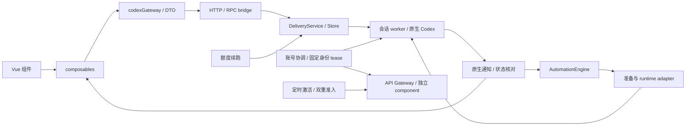

# CodexApp 现行架构设计与开发规范

本文以 0.2.19 封测代码为准，供长期维护 0.2 和设计 0.3 时使用。目录与接口是现有实现；编码要求约束今后新增或修改的代码，不代表历史代码已全部符合。具体运行产物与验证边界见 [[20260913-0008-codexapp-0.2封测验收与运行维护]]。

## 1. 系统边界

CodexApp 是浏览器与主机 Codex app-server 之间的应用层。浏览器负责展示、交互和本浏览器草稿；服务端负责持久台账、账号与执行资源；原生 Codex 负责实际回合、工具和工作目录。浏览器断开不会自然停止服务端任务。

定时激活走最小 API 请求，独立于普通会话发送队列。项目组织、暂留筛选、圆点和引导显示投影位于展示与元数据层，不能越过上述执行边界。

## 2. 代码地图

以下路径相对仓库根目录。先按职责定位，不能凭旧文件名断言模块已废弃。

| 领域 | 入口 | 职责和修改边界 |
| --- | --- | --- |
| 应用壳 | `src/App.vue`、`src/router/index.ts` | hash 路由、页面区、全局弹窗及布局；EmptyRouteView 是壳架构适配 |
| 会话状态 | `src/composables/useDesktopState.ts` | 会话选择、加载、发送、通知协调；不得成为第二个后端调度器 |
| 业务 API | `src/api/codexGateway.ts`、`codexRpcClient.ts`、`appServerDtos.ts`、`normalizers/` | 协议、能力、请求与 UI 数据归一化 |
| 发送展示 | `src/api/deliveryOutbox.ts`、会话投递展示相关模块 | 未确认提交和显示记录分开；HTTP 确认不等于原生正文已落地 |
| 项目组织 | `src/projectOrganization.ts`、`src/server/virtualProjects.ts`、`projectOrganizationArchive.ts` | 稳定组织 ID、展示归组和 ZIP 兼容；不能把组织 ID 当 cwd |
| 侧栏状态 | `src/activeSidebarSession.ts`、`threadInterruption.ts`、`composables/useThreadInterruptions.ts`、`server/threadInterruptionList.ts` | 本次筛选暂留、持久问题和同步；复用既有通知连接 |
| 会话正文/输入 | `src/components/content/ThreadConversation.vue`、`ThreadComposer.vue`、`ComposerCommandPicker.vue` | 历史、Markdown、工具、问题、附件、草稿和命令 |
| 输入区尺寸 | `src/virtualKeyboardViewport.ts`、`src/App.vue`、`src/style.css` | 桌面 resize 与触屏键盘基线分开；浮层测量合并到 RAF |
| 自动化界面 | `src/components/content/AutomationsPanel.vue`、`components/sidebar/SidebarThreadTree.vue` | 列表、详情及项目/会话自动化编辑器 |
| 账号/设置/API 界面 | `src/components/accounts/`、`settings/`、`api-proxy/` | 表单和状态展示，实际操作经现有服务端入口 |
| 公共 UI | `src/components/common/`、`src/style.css` | Dialog、Popover、Select、Button、Switch、TimeInput、主题 token |
| 启动与 Web 服务 | `src/cli/index.ts`、`server/httpServer.ts`、`frontendAssets.ts`、`authMiddleware.ts` | 端口、登录、静态资源、管理 HTTP/WS；管理登录与 API key 分开 |
| 原生装配 | `src/server/codexAppServerBridge.ts` | app-server 生命周期、RPC/通知、worker、管理接口装配；仍是最大模块 |
| 账号所有权 | `src/server/accountAuthStore.ts`、`accountAuthCoordinator.ts`、`accountTokenRefresh.ts`、`accountExecution.ts`、`accountResourcePool.ts` | 身份、凭据版本、互斥、固定 lease 与有界资源池 |
| Provider 适配 | `src/server/freeMode.ts`、`openRouterProxy.ts`、`zenProxy.ts`、`customConnectionProxy.ts`、`customEndpointProxy.ts`、`unifiedResponsesProxy.ts` | 现有多出口与协议转换；旧命名不代表无调用 |
| 自动化定义与调度 | `src/server/automationDefinition.ts`、`automationSchedule.ts`、`automationDailyTimes.ts`、`automationEngine.ts` | TOML、日历、领取、四槽状态机、终态与防重 |
| 自动化原生准备 | `src/server/automationPreparation.ts`、`automationRuntime.ts` 与 bridge adapter | 90 秒准备期限、取消、迟到效果和真实资源清理 |
| 自动化持久化 | `src/server/automationStore.ts`、`automationHistory.ts`、`automationHistoryMaintenance.ts` | 单写者锁、热状态、永久事实、分段历史、离线维护 |
| 消息投递 | `src/server/deliveryService.ts`、`deliveryStore.ts`、`deliveryHistory.ts` | deliveryId、revision、排队、发送前记录、回执和 unknown 核对 |
| 额度续跑 | `src/server/threadQuotaResume.ts` | 持久续跑意图、公平扫描、稳定投递 ID；真正提交仍经 DeliveryService |
| API 出口 | `src/server/apiProxy/` | key、Responses、流式/WS、用量、账号 generation、drain 和独立 component |
| 账号激活/通知 | `src/server/accountActivation*.ts`、`accountNotificationService.ts` | 双重准入、最小请求、claim、结果；通知渠道分别管理 |
| 历史/长任务 | `src/server/threadHistory.ts`、`threadSearch.ts`、`threadGoalReader.ts`、`threadCompactionGate.ts` | 原生分页、有界搜索、原生目标/压缩能力适配 |
| 文件/git/终端 | `src/server/localBrowseUi.ts`、`projectDirectories.ts`、`reviewGit.ts`、`terminalManager.ts`、`backgroundTerminalReader.ts` | 文件预览/保存、AGENTS 受管块、Git、交互 PTY 与原生后台终端 |
| 发布维护 | `scripts/codexapp-release-switch.sh`、`scripts/check-codexapp-idle.cjs` | prepare/check/activate/rollback 与精确实例检查 |

封测时 App.vue 6,299 行、useDesktopState 5,974 行、codexGateway 3,645 行、bridge 10,078 行。大文件仍存在；本轮只抽出具体状态和资源边界，没有为了行数进行全局拆分。0.3 可替换页面组织，优先复用现有服务契约。

## 3. 核心执行契约

| 操作/状态 | 必须保留的语义 |
| --- | --- |
| 账号切换 | 新准入按当前选择解析，已经持有固定身份的执行不能因 UI 选择变化而漂移 |
| 账号移除/凭据变化 | 撤销归属连接，拒绝迟到提交；凭据 revision 变更重新核对，不影响无关账号 |
| 用户会话与自动化 | 相同目标的执行、审批与未结束准备继续受原门禁约束；无关目标在可用资源内推进 |
| 会话自动化 | 推进原指定会话，不因准备失败清空目标或悄悄改成新会话 |
| API 出口 | key 校验、固定账号/generation、流式连接与活动统计独立保持；不能借管理页本机信任绕过 key |
| 定时激活 | 低优先级可选动作，领取后和发送前均核对占用/凭据；前台、API、自动化占用能阻止激活 |
| 额度不足 | 保留原拒绝、保护和续跑准入，不靠换账号、改路由或重发绕过 |
| 暂停、取消、超时 | UI 可先反馈取消；活动计数、slot、lease 直到真实效果与清理结束才释放 |
| 阅读/忽略/关闭提示 | 只改变相应展示元数据，不能触发中断、重发、额度恢复或切换账号 |

资源当前上限为会话 worker 池 16、自动化 4、API component 池 8。这些是不同池的边界，不能相加解释成某个账号的承诺并发。API component 数也不等同 API 请求并发数。

### 准备与控制队列

自动化定期 inspect 在短串行控制区外等待；每个 run 仅一个，实际底层最多四个。回写校验 run/revision/所有权及通知版本，旧结果不能覆盖完成、取消或审批。

准备默认 90 秒。读取可终止调用者等待，实际未完成 RPC 仍占位；同参数准备读取合并，每进程最多四个实际请求。新建且独占的准备 worker 可关闭，并确认 PID 退出后释放。已有共享进程中已发出、原生不可取消的操作继续等待真实返回，不能为了释放名额强杀其他会话。

### 投递与持久事实

稳定 requestId/deliveryId → 持久领取 → 校验 revision/context → 原生提交 → receipt/通知 → 核对正文。网络超时不证明未发送。未知结果不得自动生成新 ID 重发；同 ID 不同内容必须冲突，而不是覆盖。

自动化完成先归档，归档成功后才能裁剪热状态。后台保存与控制入队可以跨 await 交错：裁剪只移除本次已归档的对象，禁止用等待前截取的整个列表覆盖实时状态，也不能把慢 dispatch 放回控制队列。历史分页缓存可淘汰，永久请求事实不能随缓存删除。只有旧索引而正文丢失时拒绝重放，不能当作“未找到请求”。

问题忽略的 GET/POST 各有 10 秒请求期限；POST 明确成功后只删除对应回合的已确认问题，界面释放按钮，摘要刷新独立进行。新问题与读取期间的 SSE 变化覆盖旧快照；刷新替换旧请求并忽略迟到回写，不触碰账号 lease 或服务端发送。

### 原生后台终端的状态所有者

`thread/backgroundTerminals/list` 的记录由原生 Codex app-server 提供。`BackgroundTerminalReader` 只在请求尚未完成时合并同一会话的查询，不缓存已完成列表，也不从命令历史重建后台终端表；停止操作核对 threadId/processId/itemId 后调用原生 terminate。不要将 `ProcessActivityStore` 的展示性工具/Hook 观察记录与原生终端存活列表混为一谈。

会话 `idle` 表示当前没有模型回合在推进；它不保证后台命令结束。`osPid/cpuPercent/rssKb` 可以为空；`processId` 是原生内部标识，不是操作系统 PID。不能将无 PID、CPU 为空或按完整命令搜索不到进程当作自动忽略/清理依据。[官方后台终端接口](https://learn.chatgpt.com/docs/app-server#clean-background-terminals)的运行中示例同样允许 `osPid: null`。

版本切换检查以非空后台终端列表为阻塞条件；闲置会话 worker 回收也检查后台终端。当前账号选择切换另走 `getAccountSwitchSnapshot()` 的固定身份规则，不能把版本切换脚本的行为泛化成所有账号/API 调度都被同样阻断。

记录归原生管理不等于某次异常已被证明由原生单独造成；客户端交互的间接诱因仍须通过复现排除。2026-09-13 发现并经用户授权停止的一条记录，仅定为“疑似残留、根因未确认”，不登记成已确认的 CodexApp 缺陷或原生缺陷。详情见 [[20260913-0012-codexapp-封版漏项补查与0.2.19交接]]。

## 4. 数据归属与迁移

以下路径均相对**对应实例的实际 CODEX_HOME**。生产和候选绝不能共用账号目录。

| 数据 | 位置 | 所有者/维护方式 |
| --- | --- | --- |
| 账号与凭据 | `auth.json`、`accounts.json`、`accounts/` | 账号 Store/Coordinator；不进入日志、文档或公开包 |
| 原生会话 | 原生 sessions、索引等 | Codex 管理；展示归组不搬动或重写它们 |
| 项目组织 | `codexapp-projects.json` | VirtualProjectStore；名称、稳定 ID、成员 cwd，仅 UI 归组；自动化归组在同一写入队列内判断是否存在，已移除时跳过归组，实际工作目录分配照常；损坏元数据仍报错 |
| 物理项目根 | `.codex-global-state.json` 中工作区字段 | 既有工作区根管理；组织与目录状态分开 |
| 项目多目录 | 项目 `AGENTS.md` 的受管标记块 | projectDirectories；保留用户其他内容 |
| 自动化定义 | `automations/<id>/automation.toml` | 定义管理；保留未知扩展字段 |
| 调度热状态/锁 | `codexapp-automations/state.json`、`scheduler.lock/` | AutomationStore；损坏或失去所有权停止执行 |
| 自动化新历史 | `codexapp-automations/history-v2/` | `records/keys` 双份永久运行事实；`pending` 写前事务；`timeline/ids` 派生索引 |
| 自动化旧历史 | `codexapp-automations/history/`、`history-keys/` | 兼容源保留，首次检测变化后复制迁移；回退前离线导出 |
| 投递与回执 | `codexapp-delivery/pending.json`、`receipts/` | DeliveryStore；不能手改状态后声称可安全重发 |
| 额度续跑 | `codexapp-quota-resume.json` | ThreadQuotaResume；重启后的不确定提交先核对 |
| 未处理问题 | `codexapp-thread-interruptions-v1.json` | thread/turn ID 和错误种类，不复制敏感错误全文 |
| 问题忽略 | `ignored-quota-errors.json` | 沿用原 API 与按回合忽略记录，扩展到普通最终错误 |
| 完成/过程标记 | `codexapp-thread-completions-v1.json`、`codexapp-hook-observations.json` | 完成列表/Hook 观察；不替代原生执行事实 |
| 激活/通知/API | `account-activation/`、`account-notifications/`、`api-proxy/` 及各渠道配置 | 各自明确写入者；API key 和投影凭据私有 |
| WebUI 登录 | `webui-auth-sessions.json` | WebUI 认证，与 Codex 账号分开 |
| 草稿、偏好、显示投影 | 当前来源 localStorage；显示投影额外支持 sessionStorage 降级 | 按浏览器/端口隔离；降级仅限显示，不进入 outbox；标签页关闭或两个存储均不可写不保证刷新恢复 |

历史分页最多 100 条，正文读取并发 8，日索引缓存最多 32 个。首次旧格式迁移可能延长自动化初始化；不得以初始化未完成当作空闲。派生索引可以修复，全部事实同时丢失只能依赖备份。原子 rename 不自动提供已验证的断电耐久性。

## 5. 开发约定

1. 每项变更先写清状态所有者、入口、取消责任、持久化完成点和迟到结果处理。小改动可以在提交说明中表达，无需增加一套流程框架。
2. 公共 UI 仅接收 typed props/emits/slots，不依赖 RPC、路由、存储或账号状态。业务组件负责保存、草稿与错误；纯领域函数负责校验与转换。
3. 新共享代码两空格、显式 import、具名处理函数，一句一个状态转换；复杂异步清理展开。不要顺带全仓格式化。
4. 外部输入从 unknown 校验。协议 threadId/turnId、错误码、模板占位符不能因中英文文案修改而变化。
5. 错误不能被吞掉后显示成功。必要的观察型 catch 要说明为何可忽略；持久化、发送、身份错误必须保留可判定结果。
6. 串行区只保护领取与写入等短操作。RPC、进程、网络等待必须有边界；超时后真实资源仍有明确所有者。
7. 所有 timer、订阅、Observer、RAF 都有关闭/卸载清理；tick 不累积无界队列。同类读取仅合并 in-flight，不随意缓存已经结束的身份/额度事实。
8. 写入用同目录唯一临时文件和原子替换；版本/枚举/归属先验证。状态损坏 fail closed，不能自动清空导致重放。迁移可恢复且保留兼容源。
9. 子进程优先参数数组，避免 shell 拼接。用户明确打开的终端与后台命令拼接分别审阅。不要输出凭据、完整上游响应或用户会话正文。
10. HTML/SVG 手动预览当前保留同源主动内容风险。新增自动/内嵌预览前必须设计独立来源和能力边界；禁止用会破坏现有预览/编辑的简单 CSP 替代设计。

## 6. 测试、性能和交接

| 改动 | 需要证明 |
| --- | --- |
| 调度/账号/出口 | 真正 adapter 与 IPC：成功、拒绝、占用、取消、迟到、清理、不同账号放行、同目标阻塞 |
| 投递/存储 | 稳定 ID、写失败、未知回执、重启、旧格式、防重；损坏事实不能被当作不存在 |
| UI | 实际改动界面、浅深主题、键盘；响应式至少 375×812、768×1024；持久化要刷新后验证 |
| 聊天链接 | TestChat 唯一标记、href/title/text、真实消息行截图 |
| 包/模块/运行时 | build 后公共 CJS/CLI、实际安装包、真实 PTY 和锁文件重装；不是只检查源码可编译 |
| 文档 | 代码事实、链接存在、NFS 挂载、同步字节一致；规划和实现分开 |

每项行为变化有性能证据：请求数量、复杂度、并发边界、耗时或 trace。尤其检查重复请求、阻塞、无界 fanout、大载荷和失效时的迟到响应。拒绝错误页、零 API 流量和旧工作树的 profiler 结果；不要为了得到更好数字不断重跑并隐藏有效慢样本。

常用命令：`pnpm run test:unit`、`pnpm run build`、`pnpm run profile:browser`、`git diff --check`。手工用例在 `tests/<domain>/`，记录前提、精确操作、期望和清理；`tests.md` 仅索引。运行依赖固定直接版本，prepare 保留实际安装锁文件；封测验证 Node 24.19.0，不把 package.json 的 `>=18` 当作已完成 Node 18 兼容验收。

子任务独立提交，显式暂存对应文件，保留他人的 UI 修改。59001 与 5900 隔离；prepare 不激活生产。发布 drain 包含用户执行、队列、审批、自动化、API、账号激活和后台终端；读取失败、unsupported、skipped-busy 均不等于零。0.2 长期维护优先局部可验证修复，避免为风格或 0.3 预想反复拆改核心链。

## 本轮显示层约束

仅名称项目目录创建回执已确认归属后，前端把该 ID 带入乐观会话行；实际 cwd 与原生请求不携带项目 ID。通知继续由原有 useOperationToast/OperationToastHost 管理，四种类型仅用于视觉和时长，不增加业务事件总线。确认框只控制用户是否发出原操作，不替代服务端门禁。
