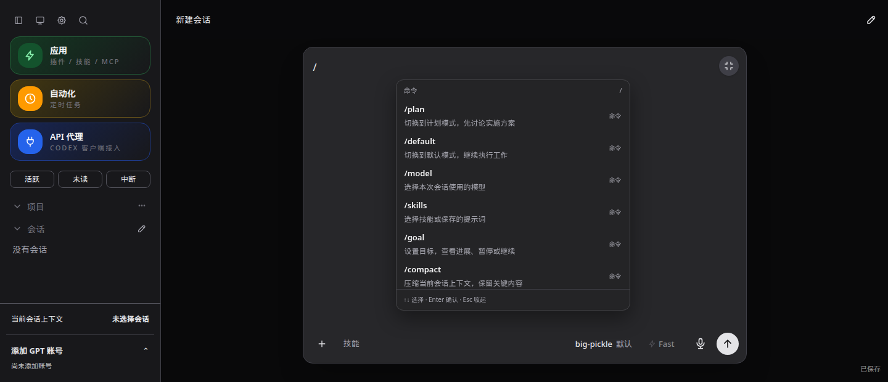
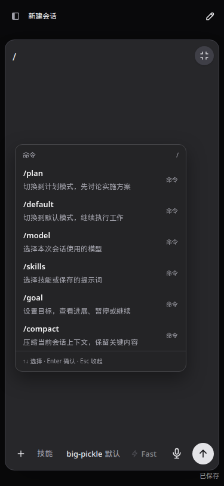
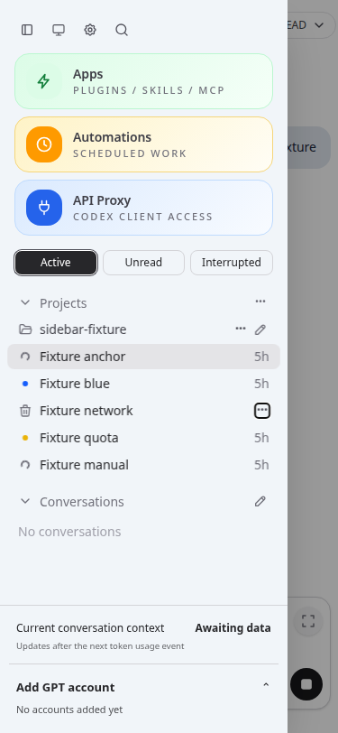

# CodexApp 0.2 封测验收与运行维护

**当前维护基线：** 0.2.19 本轮最终 UI 候选，开发/公开源码各 **121 文件、830 项通过**。完整追加验收与本次未修的既有观察见 [[20260913-0012-codexapp-封版漏项补查与0.2.19交接]] 第 9 节。下方旧测试章节保留对应阶段证据。

## 1. 固定产物与实例

| 项目 | 当前已查验记录 |
| --- | --- |
| 公开源码 / main及tag | `b1d26454703c` / `875b0319654a326889140b013270bf51b5a1429b`；文件树相同 |
| 固定发布目录 | `/home/docker/codexapp-releases/codexapp-0.2.19-b1d26454703c-20260913-123958` |
| 59001 候选服务 | `codexapp-dev-59001.service`，PID 2972162；独立原 CODEX_HOME |
| 候选入口 | http://192.168.50.46:59001/ |
| 5900 生产 | PID 2623228，仍为 `codexapp-0.2.19-d20d9fe539a3-20260913-105947`；本轮未激活或重启 |
| 临时验证服务 | 4173、59015、4195–4197 已清理；原生终端全局枚举因 busy 未核验 |
| 构建环境 | Linux / Node 24.19.0 / Chromium；认证矩阵 Codex 0.153.4 |
| API 组件 | CLIProxyAPI 7.2.152，原组件复用并校验 |

公开 tarball SHA-256：`f0aa77a6149cd824eec6f760979670b75c0fd0154ce29b0e52f5895961d14577`。78 项运行依赖复装一致，锁 SHA-256 仍为 `8e6560139ec4babe3e19fdd974452eeb4be4ade6b45a9b6dbaa7e0ccede1b43a`。

候选更新按空闲检查→冻结→复查→替换→解除冻结→复查完成，生产 PID 前后未变。最终 prepare 不等于全局空闲；check 仍有活跃回合且后台枚举 skipped-busy，必须在结束工作后从独立终端对精确路径重新 check，不能绕过门禁。

## 2. 本轮最终实现

- 系统审阅：激活发布门禁、自动化 inspect 隔离、额度续跑公平性、90 秒准备与真实所有权、运行依赖复装、长期历史和防重恢复。
- 用户追加：已审核文案、仅名称项目与组织图标、自动化窄屏留白、引导消息所见即所得、活跃暂留、持久红黄问题点与忽略。
- 最后追加：PWA focus-existing（静态及实际动态 manifest）、空草稿 `/` 命令搜索、扩大输入框菜单定位与窗口 resize 修复。
- 复审修复：保存只移除已归档对象；移除组织保留自动化与原身份；显示缓存支持标签页降级；问题请求限时且保存/摘要等待分离。

功能细节见 [[20260913-0006-codexapp-现有功能说明]]，逐项审阅结账见 [[20260913-0004-codexapp-0.2封测版本变迁与重构记录]]。

## 3. 原封测系统性测试结果（df6a5cb 基线）

| 验证层 | 最终结果 | 证据/边界 |
| --- | --- | --- |
| 全量 Vitest | **120 个文件、815 项通过，0 失败、0 跳过** | `sealed-all-tests-summary.json`；包含实际 IPC 集成，不只是纯 mock |
| 核心账号/调度 IPC | 通过 | accountRuntimeIntegration、automationDispatchIntegration、automationPreparationIntegration；固定账号、准入、占用、取消、迟到、真实 PID、共享目标保留 |
| 多出口恢复矩阵 | 通过 | providerResumeMatrix：七种出口两两 49 对，恢复/分支/隐式恢复；本地真实 adapter/IPC，不冒充云端付费调用 |
| prepare/build/typecheck | 通过 | `sealed-prepare.log`；27 个 dist/dist-cli 文件与固定包一致 |
| 公共 CJS/CLI 与 PTY | 通过 | help 出口码 0；固定安装和 npm ci 副本均实际创建 PTY，输出 PREPARED_PTY_OK |
| 依赖复装 | 通过 | 78 个运行依赖实际版本匹配部署锁；锁文件未变 |
| 旧包→新包缓存 | 通过 | 临时 59015；入口 no-store、无 ETag、旧 JS 404、新资源 immutable；API 无 key 401，激活 ready 且无活动 |
| 项目组织真实 HTTP/文件 | 通过 | 名称创建、同名、改名、归组、cwd/原会话字节不变、无 AGENTS 副作用、浏览、ZIP 往返、重启、移除保留文件 |
| 原有物理项目 | 通过 | 本机真实 GitHub clone；安装包容器以 nobody 验证 EACCES 和失败后不登记假根目录 |
| 历史进程恢复 | 通过 | 五个写入检查点 SIGKILL 自有子进程；重启仅一个原 run，旧读法兼容导出，认证哨兵不变 |
| 项目/自动化 UI | 通过 | 六尺寸 × 明暗边距≥12px；三主视口 × 中英文 × 明暗编辑；组织图标、刷新、归组和移除 |
| 引导 UI 与 TestChat | 通过 | 4173 与 59001 安装包；挂起提交、切换、刷新、历史/队列失败、unknown/failed/accepted、原生回显去重；href/title/text 全通过 |
| 活跃/问题 UI | 通过 | 三视口明暗；完成/手动停止暂留、阅读切走、筛选重开、问题刷新保留、忽略/撤销、保存失败、手机侧栏重挂载 |
| 扩大输入框 | 通过 | 15 组断言；连续 1440×1000→1440×620→1100×620→768×1024→375×812→375×500→1440×1000，浅深主题；草稿/选区保留 |
| 普通命令菜单 | 通过 | 59001 安装包，三视口明暗、中文/英文无匹配文案、正文不激活、键盘/Esc；无 turn/start |
| PWA | 通过轻量检查 | 静态与品牌动态 manifest 字段一致，59001 实际 HTTP 返回 focus-existing；未做 OS 安装/快捷方式循环测试 |
| 安装包原生认证故障 | 通过 | 4195/4196/4197，见下一节；无生产凭据 |
| 59001 实际页面 | 通过 | 0.2.19、manifest、问题摘要 200、正常 UI，无页面异常或执行请求 |

全量测试命令：

```bash
pnpm exec vitest run --reporter=json --outputFile=output/0219-final/sealed-all-tests.json
CODEXAPP_SWITCH_STATE_ROOT=/home/docker/codexapp-dev-0219-switch-state bash scripts/codexapp-release-switch.sh prepare
node scripts/test-project-organization.cjs
CODEXAPP_TEST_GITHUB_CLONE=1 node scripts/test-project-root-api.cjs
node scripts/test-automation-history-recovery.cjs
node scripts/test-project-organization-ui.cjs
node scripts/test-sidebar-active-retention-ui.cjs
node scripts/test-expanded-composer-ui.cjs
node scripts/test-steering-visibility-ui.cjs
UI_BASE_URL=http://127.0.0.1:59001 UI_SOURCE_PERF=0 UI_SCREENSHOT_LABEL=packaged UI_REPORT_PATH=output/0219-final/sealed-steering-packaged-ui.json node scripts/test-steering-visibility-ui.cjs
UI_BASE_URL=http://127.0.0.1:59001 UI_LABEL=sealed node scripts/audit/0.2.19-slash-ui.cjs
```

公共 CJS 的实际命令：

```bash
node -e "process.argv=['node','codexapp','--help']; require('/home/docker/codexapp-releases/codexapp-0.2.19-0612357254c4-20260913-101637/dist-cli/index.js')"
```

该命令出口码 0。真实 PTY 和依赖验证由 `sealed-package-smoke.cjs` 执行；脚本和报告归档在本页 assets 中，避免仅留下一次终端结论。

### 安装包 Docker 矩阵

镜像从已备好的 Codex 基础镜像安装当前 tarball 和 `@openai/codex@0.153.4`：

```bash
docker build -t codexapp-final-test:0.2.19 -f output/0219-final/Dockerfile output/0219-final
node scripts/test-packaged-provider-matrix.cjs
docker run --rm --name codexapp-0219-sealed-project-permission -v /home/Code/codexapp/scripts/test-project-root-api.cjs:/tests/project.cjs:ro -e CODEXAPP_TEST_CLI=/usr/local/lib/node_modules/codexapp/dist-cli/index.js -e CODEXAPP_TEST_UNPRIVILEGED=1 codexapp-final-test:0.2.19 node /tests/project.cjs
```

4195 无认证启动为 opencode_zen，切换为 openrouter_free；4196 损坏认证回退 Zen；4197 合成无效 ChatGPT 认证保持默认 OpenAI 路径，实际原生返回认证刷新失败（auth refresh request failed: code=-32001），失败回合刷新后仍可见，重复 live overlay=0，合成 auth 原文件不变。测试容器只读挂载主机公共 CA，未改变应用/生产信任配置。临时容器与 home 均由脚本清理。

不把 API-key-only fixture 冒充无效 ChatGPT 登录，也不把容器 TLS UnknownIssuer 当作认证用例通过。无认证与 OpenRouter 测试验证配置选择，未用真实 key 验证云端成功消费。

### 本轮遇到的测试问题

1. 首次 4173 引导测试在 pending 提交后刷新时出现加载恢复页；该次没有足够的模块失败细节，不能认定根因已经修复。补充 console/request 诊断后，两次完整开发服务器运行通过，59001 实际包同样通过；未据此修改核心发送代码。
2. 第一次对安装包运行引导脚本，交互全部通过，但尾部开发专用微基准尝试 import `/src/...` 失败。新增显式 `UI_SOURCE_PERF=0` 只跳过源码采样，所有交互断言保留；安装包和开发微基准分别重跑通过。这是测试目标适配，不是关闭产品错误检查。
3. 最小 Docker 镜像没有 Git，组合 clone 用例得到 spawn git ENOENT。随后在具备 Git 的主机测试真实 clone，在原安装包容器测试权限失败，两者均通过；不声称该最小镜像自动附带 Git。

最初失败日志保留于任务 output，最终报告不把它们算作通过，也不省略出现过的不确定加载现象。

## 4. 性能审阅

最终有效首页 profiler 目标为 `http://127.0.0.1:4173/`，实际正常应用页面、无失败响应、未停在 Loading threads。总 API 15.3KB；thread/list 首屏、skills/list、额度读取、provider-models 各一次。quota-resume 和 pending 各两次是 initial/ready 的现有同步，未为减少数字删除恢复读取。

该轮 provider-models 约 1,111ms，产生一项慢请求警告；free-mode/status 约 888ms。保留这个有效慢样本，不宣称首页所有请求均很快。报告与 trace 原件：`output/playwright/browser-runtime-profile-home-2026-09-12T19-00-52-457Z.*`，摘要归档见 `browser-profile.json`。

| 路径 | 测量/审阅结果 |
| --- | --- |
| 引导显示投影 | 5,000 条历史 + 100 显示记录，100 次采样，中位约 0.30ms/p95 0.50ms；无显示记录复用历史数组 |
| 活跃集合更新 | 5,000 会话，100 次采样，中位约 0.30ms/p95 0.80ms；不含 Vue 完整渲染/网络 |
| 历史分段阶段基准 | 1,000 条/100 天，归档约 1.19 秒；100 条分页中位 7.00ms/p95 7.95ms；键查找 0.10/0.19ms；日缓存 11，上限 32 |
| 新命令菜单/resize | 无新 API；菜单≤12 可见行；Observer/resize/scroll 通过单 RAF 合并，关闭释放；桌面高度不单调累积 |
| 项目/问题同步 | 线性组织映射，复用既有 SSE；摘要 GET 不调用原生 RPC，不全量扫描历史；缓存失效有迟到保护 |
| 构建 | 主入口 850.98KB/gzip 270.16KB，CSS 450.43KB/gzip 50.93KB；大分块警告仍在 |

微基准不等同长会话真实渲染或高并发云端负载，历史阶段基准也不等同 NAS 多年历史测量。未为 0.3 提前拆包或改写核心资源池。

## 5. 截图与证据

截图前等待约 2.2–2.5 秒。UI 使用 Playwright CJS：引导、侧栏、项目需要网络故障/状态注入，Browser bridge 无法可靠完成这些动作；模拟 UI 和真实 HTTP/IPC 已分别记录。JSON 内保留具体视口、断言与截图清单。

| 界面 | URL/视口 | 断言 | 原始绝对路径 |
| --- | --- | --- | --- |
| 扩大输入框 | `http://127.0.0.1:4173/`；1440×620、768×1024、375×812，明暗 | 菜单居中、首行不遮、连续 resize 正确、选区保留 | `/home/Code/codexapp/output/playwright/0219-sealed-composer-{1440,768,375}-{light,dark}.png` |
| 项目与留白 | 4173，六尺寸明暗；编辑器三视口中英文 | 组织刷新保留、图标变化、边距≥12px | `/home/Code/codexapp/output/playwright/0219-project-*`、`0219-automations-margin-*` |
| 引导与链接 | 4173 与 59001 的测试会话；三视口明暗 | 一条正文、状态恢复、href/title/text | `/home/Code/codexapp/output/playwright/0219-steering-*`、`testchat-steering-visibility-cjs.png` |
| 活跃与圆点 | 4173 测试会话；1440×1000、768×1024、375×812 明暗 | 暂留、持久圆点、忽略/失败/撤销 | `/home/Code/codexapp/output/playwright/0219-sidebar-active-*` |
| 原生认证失败 | `http://127.0.0.1:4197/#/thread/<测试ID>`；1440×1000 明暗，完整 URL 在 JSON | 刷新后保留，重复 overlay=0 | `/home/Code/codexapp/output/playwright/0219-packaged-invalid-auth-{light,dark}.png` |
| 普通命令菜单 | 59001；三视口明暗 | 正文不激活、空结果中英文、无发送 | `/home/Code/codexapp/output/playwright/0219-slash-*-sealed-*.png` 及 `0219-slash-sealed-*` |
| 实际候选 | `http://127.0.0.1:59001/`；1440×1000 深色 | 正常加载、manifest、无执行请求 | `/home/Code/codexapp/output/playwright/0219-sealed-candidate-dark.png` |

本页相对资源目录：`assets/0.2.19-sealed/`。下列均为实际截图，完整清单见 `evidence-index.json`。







## 6. 明确保留与未验证范围

| 项目 | 长期维护决定 |
| --- | --- |
| 手动 HTML/SVG 同源主动预览 | 保留风险以维护模块/相对资源/编辑功能；0.3 新增自动或内嵌预览前设计独立来源和能力边界 |
| 共享原生不可取消操作 | 继续等待实际结束并持有 lease/slot；不能强杀其他会话、提前释放或重发冒充恢复 |
| 历史耐久性 | 永久事实不自动删除；SIGKILL 恢复已测，突然断电、所有副本损坏和 NAS 大规模历史不在本轮承诺内 |
| 大模块/构建大块 | 保留；只有明确故障或独立需求才局部修改，避免三天两头重构 |
| 上游与真实账号 | 未用生产凭据测试正常消费、自然额度重置、长周期任务；本地 IPC 不等于这些场景 |
| 客户端兼容 | Node 24.19.0 与 Chromium 已测；Node 18、所有 OS/PWA 启动器、真实手机软键盘未全覆盖 |

用户原则继续有效：账号切换、账号调度、用量、API 出口、自动化出口及其阻塞/放行属于核心功能。任何后续修复若无法证明保留这些契约，应撤回该修复；可以保留已知风险，不能让业务暗中退化。

## 7. 运行、备份、故障处理与回退

日常观察先区分：页面显示问题、投递未知、调度准备未结束、账号/额度拒绝、实际原生执行和 API 长连接。不要从某个 Promise 超时或界面没有会话行推断进程空闲。

| 现象 | 先检查 | 避免的动作 |
| --- | --- | --- |
| 引导内容等待/未知 | 投递 ID、queue/receipt、原生回显与显示缓存；存储写满时检查标签页显示副本 | 新建 ID 连续重发或直接清空台账 |
| 忽略按钮或摘要读取失败 | 请求是否超时、对应回合 POST 是否确认成功；读失败与写失败分开 | 将未确认写入当作忽略成功或改动账号保护 |
| 自动化取消后仍占位 | 准备 activity、实际 RPC、worker 所有权与 PID | 强杀共享进程、手工释放 lease |
| 红黄点阅读后仍在 | 对应回合问题是否已忽略 | 将阅读改成自动忽略或关闭额度续跑 |
| 历史查询/初始化失败 | 调度锁、热状态校验、pending、双份事实与旧兼容源 | 删除历史目录或把损坏记录解释成未执行 |
| 页面发布后加载失败 | HTML no-store、实际 JS 路径、旧资源 404、浏览器请求 | 未保存草稿就强制反复刷新 |
| 会话空闲却阻塞版本切换 | 原生 loaded/list 与 backgroundTerminals/list，核对 threadId/processId/itemId；空 PID 不证明退出 | 按空 PID/零 CPU 自动放行、混用内部 processId 与 OS PID、强杀其他会话 |
| 账号/API 不可用 | 固定身份、generation、凭据 revision、活动与准入拒绝原因 | 切换到其他账号绕过本应存在的阻塞 |

备份应覆盖对应实例完整 CODEX_HOME 及必要项目文件，私密存储，不进入仓库或公开包。需要一致快照时在目标停止/静止状态备份；运行中的原生数据库/WAL 不能随意只复制单文件。至少保留上一固定发布目录与对应 lock、自动化定义/热状态/新旧历史和项目组织元数据。恢复演练使用独立 home。

回退旧应用前，先停止目标实例的调度器并确认无其他写入者，用**当前新包**导出兼容历史：

```bash
node /home/docker/codexapp-releases/codexapp-0.2.19-d20d9fe539a3-20260913-105947/dist-cli/index.js automation-history --home /明确的目标CODEX_HOME --export-legacy
```

命令必须取得同一 scheduler.lock，失败即停止回退步骤；不删除新事实。单纯修复派生索引时省略 `--export-legacy`。完成兼容导出、备份和精确空闲检查后，才按已有 release-switch 流程切换旧程序。上面的占位路径不能直接复制执行，本页没有授权现在回退生产。

prepare 只创建固定产物；激活须重新核对实时状态，不能使用本页的历史空闲结果。冻结/检查失败时保留原实例并解除不应残留的 drain；不把未知活动计作零。不触碰长期 5173，测试仅清理确定属于自己的容器、home 和验证进程。

## 8. 文档归档与 0.3 交接

Obsidian 已确认目标为 `开发/codexapp/history`。旧版本材料和旧证据集中归档，新的两份 0.3 UI 设计稿及 `assets/0.3-ui-design/` 留在原位。六份现行总览以本页及导航互相链接，复审与修复记录另有 0010/0011；本次迁移 96 份根目录历史材料及配套素材，共 831 个文件；保留两份设计稿及 14 个设计素材文件。核对 490 个原有可解析链接，仅调整设计稿内 5 个指向历史材料的相对链接。归档清单保存迁移前后哈希和这些调整，确保归档可以核对。

项目仓库的旧 docs/plans 保留，避免破坏代码/AGENTS 的历史引用；只整理用户指定的 Obsidian 项目目录。归档不把旧规划变成已实现功能。0.3 可据现行功能、UI 规范与核心契约重新设计页面，0.2 固定包继续作为可回用的封测基线。


## 封版漏项补查（2026-09-13）

最终公开版本 0.2.19 已合入 PR #6 并发布；开发/公共源码均 826/826。当前 59001 与 prepared 路径均为 `/home/docker/codexapp-releases/codexapp-0.2.19-d20d9fe539a3-20260913-105947`。封版交付时 5900 尚为 0.2.18，check 被活跃回合阻挡、后台终端跳过；后续授权停止一条疑似残留记录，再在文档同步时查验生产已运行 0.2.19。临时测试服务已清理；未来切换仍须独立终端重新检查。 详见 [[20260913-0012-codexapp-封版漏项补查与0.2.19交接]]。
