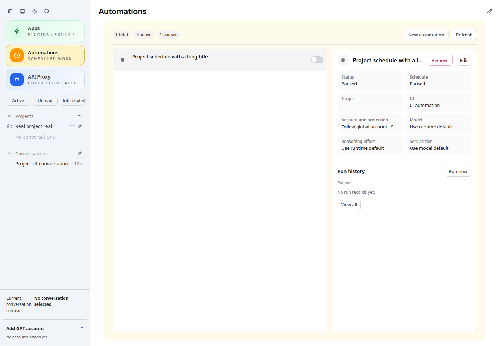
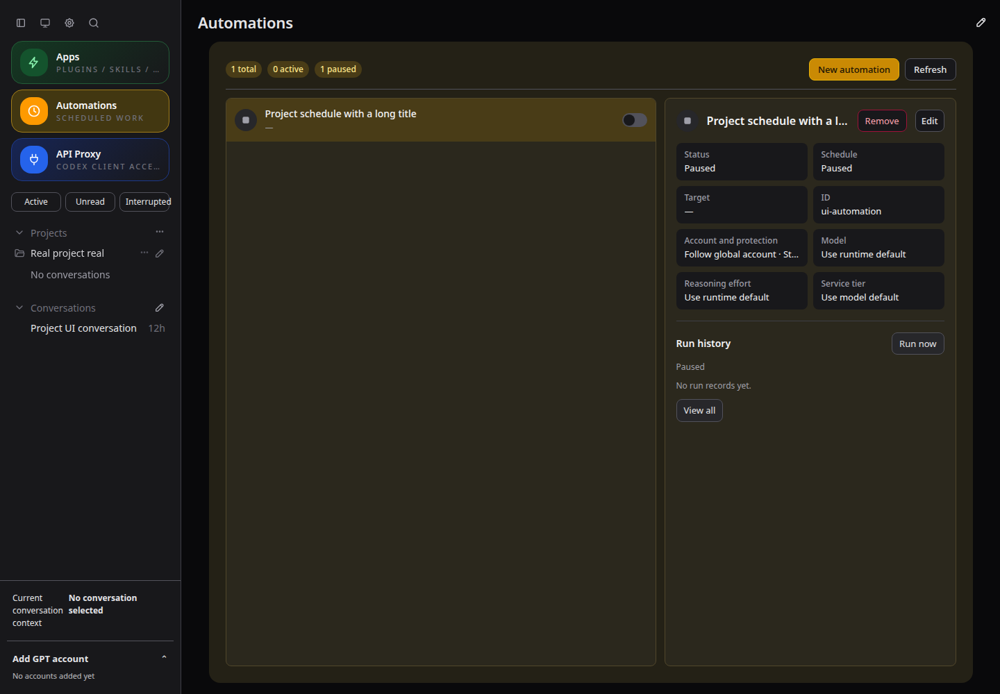
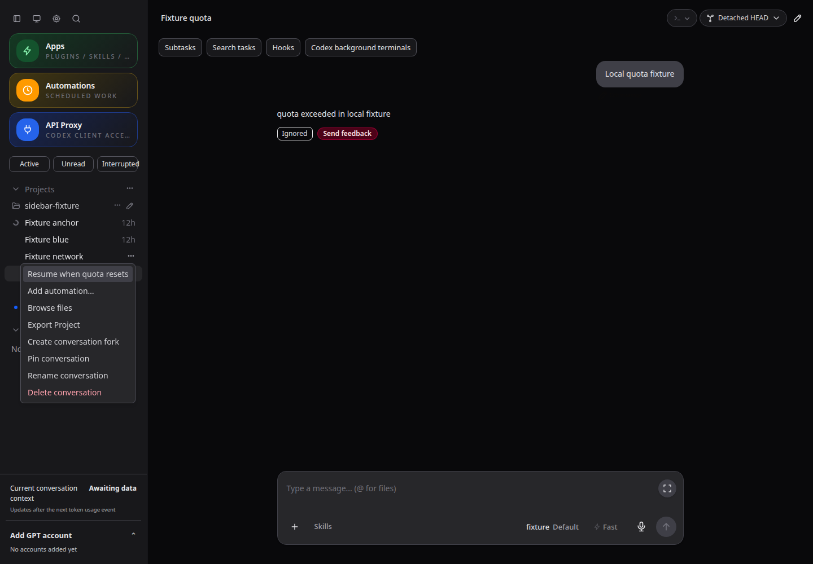
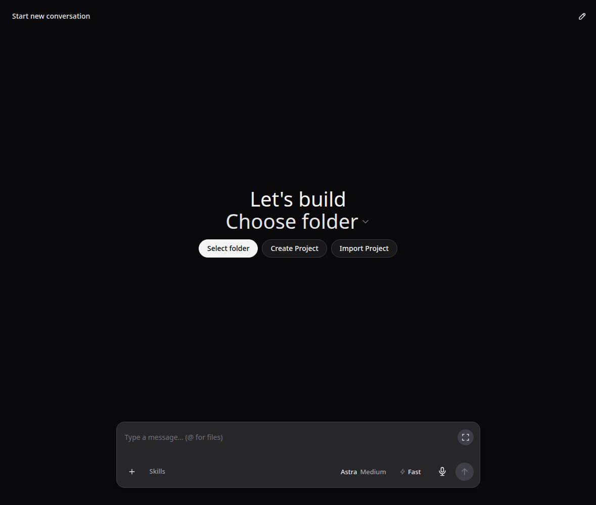

# CodexApp 0.2 封测复审问题修复与回归

> 本文保留四项修复阶段的 823 项测试与当时运行包。后续封版已另补至 826 项，并完成 GitHub 发布、prepare 和后台终端排查；2026-09-13 11:32 查验生产也已运行最终 0.2.19。最新状态见 [[20260913-0012-codexapp-封版漏项补查与0.2.19交接]]，下文旧 PID/版本不表示当前状态。

REV-01–04 已按上一轮的最小修复计划完成，**121 个测试文件、823 项全部通过，0 失败、0 跳过**。额外完成真实 HTTP/原生 IPC、自然到点任务、浏览器故障回放、打包认证、依赖复装和进程恢复验证。已将修复后的 0.2.19 固定包更新到 59001；生产 5900 保持原 0.2.18。已测范围没有发现账号、API 出口、额度、调度及互相阻塞/放行回归，未为修复调整这些规则。

修复前的审查事实保留在 [[20260913-0010-codexapp-0.2封测全量复审与需求结账]]。该记录的“未修复/待处理”属于历史时点；本文记录后续处置，不将缺陷探针的绿色误算成修复验收。原有 SEC-01、OBS-01 等保留项仍见本文第 5 节。

## 1. 四项修复与核心边界

| 问题 | 修复后的行为 | 保留的核心契约 | 提交 |
| --- | --- | --- | --- |
| REV-01：旧保存覆盖新入队运行 | 保存只从实时列表移除本次已经归档的对象，跨 await 新增的运行继续保留 | 控制/保存队列仍分离；不把慢 dispatch 放回控制队列；原入队、调度、历史、防重和账号准入不变 | `525eb2d` |
| REV-02：移除组织导致自动化失效 | 自动化生成普通无项目工作目录，组织仍存在时才附加展示归属；侧栏移除不再连带删除任务，自动化页失效目标显示“—” | 既有 cwd 不搬动；原任务 ID、TOML、账号及出口保留；不通过删除、暂停或另建任务掩盖失败；普通目录项目原移除逻辑不变 | `04ca8cc` |
| REV-03：存储写满后引导正文消失 | 持久显示缓存写不进去时，转存当前标签页；刷新/切换仍显示已受理正文，原生回显后清除两处副本 | ACK 不降级为失败；显示副本不进入 outbox；不重发、不改变 deliveryId，不修改服务端投递链 | `3c54516` |
| REV-04：挂起摘要锁住“忽略” | GET/POST 各有 10 秒期限；明确保存成功即移除对应回合问题并释放按钮，摘要独立刷新、替换旧请求，迟到结果受保护 | 未确认写入保留问题，不自动重试 POST；新问题不被旧忽略清除；不释放账号资源，不改额度保护或实际任务状态 | `9d40839` |

REV-02 的浏览器测试发现了上一轮 HTTP 探针没经过的入口：侧栏“移除项目”还会单独发送删除自动化请求。因此同时修复这个入口，新增“任务仍在、没有 DELETE 自动化请求”的断言。服务端只对自动化的可选展示归属放宽；普通用户操作不存在项目仍报错，损坏元数据/非法目录仍拒绝，未用通用 catch 吞掉错误。

REV-03 是有边界的显示降级：sessionStorage 只承诺当前标签页中的切换和刷新。关闭标签页，或 localStorage 与 sessionStorage 同时不可写时，不保证这份副本还在。该情况下仍保留实际 ACK，不以界面故障制造重复执行。未新增解释横幅或“虚拟项目”文案。

## 2. 本次实际重跑的测试

| 验证 | 结果与断言 | 证据 |
| --- | --- | --- |
| 全量 Vitest | 121 文件 / 823 通过；包括账号协调、真实 IPC、49 对提供方恢复、API key/用量/额度/长连接、自动激活、投递、续跑等原有套件 | `all-tests-summary.json`；完整原始结果在 `output/0219-revision/all-tests.json` |
| REV-01 确定性交错 | 延迟一次真实历史归档，分别交错手动/定时入队和完成通知；检查内存、磁盘、历史、稳定 ID、重启后仍排队、只执行一次 | `src/server/automationPersistence.test.ts`，2 项；相关 automation/history 合计 48 项通过 |
| REV-02 元数据与 IPC | 并发移除/归组、保留另一组织成员关系；损坏文件和非法目录仍失败；既有 dispatch/preparation IPC 共 13 项再次通过 | `virtualProjects.test.ts` 5 项；`rev02.log` |
| REV-02 真实 HTTP × 调度器 | 项目正常运行 → 移除 → 再运行；TOML/认证不变、同 requestId 同 runId、一次原生 turn；显式 retry 的关联和防重正确；再启用分钟规则、固定原账号、自然到点完成并暂停，nextRunAtMs 为空 | `virtual-automation.json`；59 次请求均为隔离 fixture；没有改系统时间/调度状态来模拟自然到点 |
| 项目真实 HTTP/文件/ZIP | 名称/同名创建、改名、归组、原会话字节/cwd/文件不变、无 AGENTS 副作用、ZIP 往返、重启、移除与物理项目文件保留 | `project-http.json`，4 组场景；独立 home + 原生 IPC fixture |
| 项目实际组件回放 | 24 张截图，创建/编辑/改名/归组/刷新/图标/移除；中英文、浅深主题、6 个宽度；移除后自动化保留，未发送删除自动化请求，目标无内部 ID | `project-ui.json`；4173 的实际组件，接口状态受控 |
| REV-03 单元与浏览器 | 缓存写满后 ACK 仍 accepted、一次提交；刷新看到同一正文；有空间后恢复持久缓存，旧 queued 不覆盖 accepted；两种存储都失败也不改 ACK/重发 | `useConversationDeliveries.test.ts`；`steering-ui.json` 与 `steering-packaged-ui.json` |
| 引导 UI / TestChat | 4173 与 59001 安装包均通过：等待、切走/切回、刷新、发送前失败、历史/队列读取失败、accepted 后缺历史、原生回显去重；hrefOk/titleOk/textOk 全 true；local 显示副本 0、tab 副本 1 | 两份 steering 报告；三主视口、浅深主题；采用存储故障注入与受控响应，无真实云端重发 |
| REV-04 单元与实际组件 | 永久 pending 的 GET/POST 有界；SSE 重连恢复；旧读迟到不能覆盖；保存失败不被读取错误掩盖；两会话可连续忽略，旧/新摘要都挂起也不锁后续按钮 | `useThreadInterruptions.test.ts` 5 项；`sidebar-ui.json` 6 组场景，8 张截图 |
| 进程崩溃恢复 | 5 个归档检查点逐一终止自有子进程；锁恢复、原运行唯一、旧导出可读、合成认证不变 | `history-recovery.log` |
| build / 类型检查 | 正常 vue-tsc 与最终 build 均通过；prepare 再次构建已提交源码 | `typecheck-final.log`、`build-final.log`、`prepare.log` |
| Docker 真实原生认证矩阵 | 4195 无认证 → Zen → OpenRouter；4196 畸形认证 → Zen；4197 无效认证收到真实原生 authentication 错误，刷新持久、重复 live overlay 为 0、合成认证不变 | `packaged-provider-matrix.json`；镜像 `codexapp-revision-test:0.2.19`，Codex 0.153.4；不是云端成功消费测试 |
| 固定包 / 依赖 / CJS / PTY | 27 个 dist/dist-cli 文件一致；78 个运行依赖实际版本与锁一致；npm ci 锁不变；固定包和复装副本均真实创建 PTY，输出 PREPARED_PTY_OK；CJS CLI help 退出 0 | `prepared-verification.json`、`cjs-smoke.log`、`npm-ci.log` |
| 旧包 → 新包缓存 | 临时 59015，旧 0.2.18 与新包使用同一浏览器；入口 no-store、无 ETag、旧 JS 404、新资源 immutable；无 key API 401，激活 ready/无占用 | `prepared-verification.json` |
| 候选实际页面与交接 | 59001 正常 0.2.19 页面、manifest focus-existing、问题摘要 200，无 pageerror/执行请求；更新前、drain 后、更新后及最终独立检查均空闲 | `candidate-check.json`、`candidate-update.json`、`idle-final.json` |

核心 suite 中：accountRuntimeIntegration 3、automationDispatchIntegration 8、automationPreparationIntegration 5、API gateway 27、API quotaProtection 10、threadQuotaResume 10、DeliveryService 14 均通过。providerResumeMatrix 是一项包含 49 对组合的测试，不能把这 49 对重复加入 823 的总数。

本次没有重新逐格执行全部旧手工清单。与四项修复无关的真实 GitHub clone、nobody 权限和扩大输入区/普通斜杠菜单完整几何矩阵，沿用上一阶段相同相关代码的结果；本次全量单元回归仍覆盖相关逻辑。原证据与范围见 [[20260913-0008-codexapp-0.2封测验收与运行维护]]。手工表格是测试说明，不是全部签字通过的凭据。

## 3. 性能与请求审计

- **REV-01：** 原有持久化串行队列保留，内存裁剪为有界的集合查找与线性过滤，不新增锁或外部请求。新增确定性交错证明慢归档期间手动/定时入队仍可推进，没有重新串行化整个 dispatch。
- **REV-02：** 原来的独立 cwd 分配和元数据写入队列不变；存在性在同一写入队列内判断。不扫描全部会话，不新增账号/模型 RPC 或永久删除清单。侧栏移除组织少一次删除自动化请求。
- **REV-03：** 单次显示保存最多检查两份缓存、依次尝试两次本地写入，只有持久写失败才使用标签页；读取只合并两份显示记录后排序一次。没有网络请求或发送重试；空投影继续返回原消息数组。5,000 条历史 + 100 条投递，100 次纯函数采样中位 0.30ms、P95 0.70ms。
- **REV-04：** 正常 GET 合并在途读取；成功忽略替换过期摘要，一次 ready 恢复至多发起一次后续读取，多 ready 仍合并。无周期性新轮询；卸载清理请求与计时器；每个写入串行且有期限。5,000 会话暂留筛选的 100 次纯函数采样中位 0.40ms、P95 0.90ms。
- **真实首屏采样：** `http://127.0.0.1:4173/`，1440×1000；当前仓库 Vite、非错误页、已结束会话加载。API 总响应 15.3KB；thread/list 首屏 1、skills 1、quota 1、provider-models 1，重复历史读取 0，profiler warnings 为空。provider-models 885.5ms、free-mode/status 863ms，保留该有效样本，不以无警告声称所有响应都很快。共耗时约 7.62 秒包含主动等待 7 秒，不能解释为页面加载耗时。
- **构建体积：** 首包 852.20KB / gzip 270.60KB，CLI 989.81KB；超过 500KB 的既有块警告仍在，本轮不顺带拆包。纯函数微基准不代表完整 Vue 渲染、多年存储或满容量磁盘的耗时，这些未做大规模实测。

首轮 profiler 因 Playwright 自带 Chromium 未安装而未启动；改用现有 `/snap/bin/chromium` 后有效完成，未为测试修改应用代码。故障回放日志中的受控 404/500 与注入的坏历史/队列响应对应，pageerror 数均为 0；不把预期故障日志当成额外产品故障，也不把它们从场景描述中隐藏。

## 4. 固定包、运行状态和证据

- 固定包：`/home/docker/codexapp-releases/codexapp-0.2.19-0612357254c4-20260913-101637`；源码四项修复分别提交，`0612357` 仅隔离重复测试报告，`74e9321` 仅补自然到点/重试组合测试，文档更新不改变已验证应用包。
- 候选：`http://192.168.50.46:59001/`，`codexapp-dev-59001.service`，独立 `CODEX_HOME=/home/docker/codexapp-dev-0218/codex-home`，本次更新后 PID 2323075。
- 生产：5900 / 0.2.18，PID 始终为 4010970，启动时间仍为 2026-09-12 22:15:58；未改服务、账号或出口配置。**REV-01 的旧有潜在问题因此没有在生产包中被部署修复**，不能把候选验收说成生产修复。
- 首次 59001 更新的 API drain 返回 409（账号操作/出口变更忙门禁）；未改启动项，已解除先前 drain。再次完整检查、按原门禁正常放行后才替换。没有放宽门禁、force drain、终止活跃用户任务或为“能更新”修改核心代码。
- 更新前后及回放完成后的独立清单：activation/live executions/active turns/queued/pending approvals/API connections/API requests/background threads 均 0，backgroundCheck=supported、loadedThreads=0。读取失败与 skipped-busy 从未被当成空闲。
- 自有容器、临时 home、测试工作目录和 59015/4195–4197 进程均清理；4173 保留运行，5173 未操作。两份用户 0.3 设计稿及素材未改动、未暂存提交。

完整索引：[修复证据与 SHA-256](assets/0.2.19-revision/evidence-index.json)。原始完整日志位于 `/home/Code/codexapp/output/0219-revision/`。已更新相关三个测试域手工文档、六份现行总览和历史复审入口，先写仓库再同步 `开发/codexapp/` 并逐文件比对。

主要复现命令（在仓库根目录执行，全部使用独立测试状态）：

```bash
pnpm run test:unit
pnpm run build
node scripts/test-removed-project-automation.cjs
UI_REPORT_PATH=output/0219-revision/project-http.json node scripts/test-project-organization.cjs
UI_LABEL=revision UI_REPORT_PATH=output/0219-revision/project-ui.json node scripts/test-project-organization-ui.cjs
UI_FAIL_DISPLAY_STORAGE=1 UI_SCREENSHOT_LABEL=revision UI_REPORT_PATH=output/0219-revision/steering-ui.json node scripts/test-steering-visibility-ui.cjs
UI_LABEL=revision UI_REPORT_PATH=output/0219-revision/sidebar-ui.json node scripts/test-sidebar-active-retention-ui.cjs
UI_BASE_URL=http://127.0.0.1:59001 UI_SOURCE_PERF=0 UI_FAIL_DISPLAY_STORAGE=1 UI_SCREENSHOT_LABEL=revision-packaged UI_REPORT_PATH=output/0219-revision/steering-packaged-ui.json node scripts/test-steering-visibility-ui.cjs
node scripts/test-automation-history-recovery.cjs
CODEXAPP_TEST_IMAGE=codexapp-revision-test:0.2.19 UI_LABEL=revision UI_REPORT_PATH=output/0219-revision/packaged-provider-matrix.json node scripts/test-packaged-provider-matrix.cjs
PROFILE_BASE_URL=http://127.0.0.1:4173 PROFILE_BROWSER_EXECUTABLE=/snap/bin/chromium PROFILE_WAIT_MS=7000 pnpm run profile:browser
node -e "process.argv=['node','codexapp','--help']; require('/home/docker/codexapp-releases/codexapp-0.2.19-0612357254c4-20260913-101637/dist-cli/index.js')"
```

Docker 镜像按 `pnpm run build`、`pnpm pack --pack-destination /tmp` 后的包构建，Dockerfile 收入证据目录；实际命令为 `docker build -t codexapp-revision-test:0.2.19 -f output/0219-revision/Dockerfile output/0219-revision`。Node 24.19.0，容器内 `CODEX_HOME=/codex-home`，无认证、畸形认证和无效认证均为隔离合成数据。

截图证据（完整路径列表在各 JSON；下列文件名在 `/home/Code/codexapp/output/playwright/` 下，归档副本如下）：

| 实际页面 | URL / 视口 | 断言与绝对原始路径 |
| --- | --- | --- |
| 移除后的自动化 | `http://127.0.0.1:4173/#/automations` / 1440×1000，浅深主题 | 任务保留，目标“—”；`/home/Code/codexapp/output/playwright/0219-revision-removed-project-automation-{light,dark}.png` |
| 摘要挂起后连续忽略 | `http://127.0.0.1:4173/#/thread/41111111-1111-4111-8111-111111111111` / 1440×1000，浅深主题 | 两次已确认忽略完成，按钮释放；`/home/Code/codexapp/output/playwright/0219-revision-ignore-stalled-snapshot-{light,dark}.png` |
| 引导与 TestChat | `http://127.0.0.1:4173/#/thread/11111111-1111-4111-8111-111111111111`（安装包为 59001 同路由）；1440×1000、768×1024、375×812，浅深主题 | 刷新仍一条消息，href/title/text 正确；`/home/Code/codexapp/output/playwright/0219-steering-revision-*`、`0219-steering-revision-packaged-*`、`testchat-steering-visibility-revision-cjs.png` |
| 无效认证持久错误 | 4197 的隔离原生会话 / 1440×1000，浅深主题 | 刷新仍有错误、重复 live overlay=0；`/home/Code/codexapp/output/playwright/0219-revision-packaged-invalid-auth-{light,dark}.png` |
| 真实候选 | `http://127.0.0.1:59001/` / 1440×1000 深色 | 正常加载，无执行请求；只截主内容区，排除账号与会话侧栏；`/home/Code/codexapp/output/playwright/0219-revision-candidate-dark.png` |






## 5. 明确保留的边界及回退

四项确定缺陷的触发已转为正确行为回归，当前没有因此继续重构账号/出口的需要。下列内容没有被本次结果消除：

1. **OBS-01**：上一阶段一次引导刷新出现加载恢复页，根因未确认。本次开发/安装包回放都未复现，仍保留“待稳定复现”，不能改写为已修复。
2. **SEC-01**：手动 HTML/SVG 同源主动预览仍保留风险；未增加会影响预览、编辑、相对资源的简单限制。大模块、全局缓存重写及 0.3 UI 重构也未实施。
3. **真实资源所有权**：共享原生不可取消操作仍持有 lease/slot 直到实际结束。本次前端 10 秒超时只管问题 HTTP 等待，不改变自动化 90 秒准备或原生进程所有权。
4. **显示存储边界**：仅标签页可写时的副本不承诺关闭标签页后恢复；两份浏览器存储同时不可写仍保住 ACK，不能承诺刷新可见。未把该情况误显示成发送失败。
5. **环境与长期验证**：没有使用生产凭据重跑真实云端成功消费、自然额度耗尽/重置、多日连续调度、真实断电、全部副本损坏、大规模多年历史、Node 18、所有 OS/PWA 启动器或手机软键盘。自然到点组合是隔离原生 IPC fixture，不能扩张为真实云端完成。

本次四项修复没有新数据格式迁移。若今后发现核心回归，可以撤回对应独立提交或将 59001 恢复为前一个固定 0.2.19 包；不恢复旧认证、账号选择或改写正在进行的任务。回退到不支持 history-v2 的更早包时，仍须先停止对应写入者、备份并用新包离线导出兼容历史，步骤见现行运维页。运行时必须重新检查空闲，本文的历史零活动不能用于未来强制切换。
