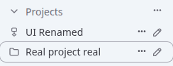
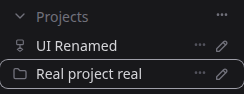

# 封版漏项补查与 0.2.19 交接

本次按用户“再琢磨有没有测试漏项”的要求，核对断言覆盖与异常组合，而非仅重复全量测试。补查后修复空项目折叠，补齐调度存储故障测试及测试脚本独立运行条件。0.2.19 已作为本轮封版提交 GitHub 并 prepare；59001 已更新，生产 5900 仍为 0.2.18。本文接续 0010 需求结账与 0011 四项修复，不把其保留项改写成已修复。

## 1. 本次发现及处置

| 漏项 | 实际影响 | 处置与验证 |
| --- | --- | --- |
| 空项目只测图标，未测内容消失 | 用户发现的空虚拟项目收起后仍显示“没有会话”；同一模板也影响空目录项目 | 先添加断言，原代码稳定失败 `1 !== 0`；空行增加折叠判断。鼠标、Enter、空格，空目录/空组织、有成员组织及刷新恢复均通过；验证真实高度只占标题行 |
| 调度在磁盘写满与重启交界缺少直接断言 | 仅看正常保存/竞争保存不足以证明失败后不会误发、恢复后不会重发 | 增加 3 项 ENOSPC 测试：已确认队列等待执行、提交意图写入前、上游受理后。保存失败停止调度，未放行不发送；已持久化队列重启只执行一次；不确定提交标记中断，重复 requestId 保持原 runId，不自动重发 |
| 公共工作树临时输出目录不存在 | 历史恢复已通过 5 个崩溃检查点，但最后写报告 ENOENT；无法可靠独立重跑 | 两个专项脚本自己创建报告父目录并支持报告路径。修复后真实子进程 SIGKILL 恢复与项目移除后自然调度验证通过 |
| 原生准备集成测试清理未等完同进程写入 | 公共全量首轮 822/823，功能断言通过，清理临时账号目录 ENOTEMPTY | 只调整 fixture：关闭 worker 后等待已排队的元数据写入，再移除目录。单测及两份源码全量复跑通过，产品代码未改 |
| 开发服务器自动刷新干扰 UI 长流程 | 同时编辑测试文件触发 Vite reload，使正在验证的编辑弹窗消失 | 服务日志确认 10:55:15 与 10:55:52 的 page reload；停止编辑后完整重跑通过。安装包 59001 再验证折叠，不依赖 Vite |

折叠修复提交 `862cf76`，只改一处 Vue 显示条件；存储故障测试 `1b3d824`，独立报告脚本 `7125e72`，fixture 清理 `1b8458c`。本次补查未改变账号、API、用量、自动化或调度的运行实现。

## 2. 核心组合覆盖与局限

- 调度准备：迟到额度读取、命名挂起、独占 worker 确认退出后释放、共享不可取消操作继续占用、取消后四槽计数、固定/默认账号及另一账号继续运行，均有现有原生 IPC 或确定性竞争测试；本轮全量包含这些用例。
- 账号/API/激活：前台活动与准备竞争、额度阈值等号、未知额度、出口连接存活、旧凭据 generation、激活迟到清理、drain 失败后恢复、切换/回滚认证保持，均有边界测试；不绕过核心门禁注入真实生产故障。
- 历史与调度：原有幂等、未知提交不重发、归档竞争保存、五个真实崩溃检查点，本轮增加上述磁盘故障与重启断言。项目移除后手动、显式重试、固定原账号自然到点、暂停、同请求防重均通过独立 HTTP/IPC 流程；CLI 哈希与最终产物相同。
- 显示：已确认引导与原生历史迟到、切换/刷新、相同正文不误去重、显示存储满、旧 revision、忽略 POST 超时、旧摘要迟到、新问题不被旧忽略吞掉；活跃暂留/红黄点/阅读/手动忽略由已有单元和浏览器故障回放覆盖。
- 空项目本次新增“元素是否消失、高度是否收缩、刷新后是否保留”的直接断言，补上此前仅看图标的弱验证。

以上不是任意账号、任意操作时序的穷举证明。真实云端成功消费、自然额度耗尽/重置、多日连续运行、真实断电、多年大规模历史、Node 18 全能力、所有操作系统、Windows 已安装 PWA 启动器及手机真实软键盘仍未全部实测。保留 OBS-01 待稳定复现、SEC-01 手动主动预览风险、共享原生不可取消操作等待、双显示存储均失败时无法承诺刷新恢复等边界。详见 0011；没有为消除所有理论风险重构核心。

## 3. 本轮测试结果

| 层次 | 结果 |
| --- | --- |
| 开发源码与实际公开源码 | 各 826/826，121 个文件，零失败、零跳过；包含新增 3 项存储测试，49 组合 provider-resume 矩阵包含在总数内 |
| 聚焦存储与竞争持久化 | 40/40 |
| 项目浏览器 | 完整创建、改名、折叠、归组、刷新、自动化标签与移除回归通过；明暗主题，编辑器 1440/768/375px，自动化边距 6 档宽度 |
| 59001 实际安装包折叠 | 空组织/空目录只保留标题，键盘、鼠标、刷新通过；pageerror=0，未发送回合或切换账号 |
| 真实原生认证 Docker | `codexapp-seal-test:0.2.19`，Codex 0.153.4；4195 无认证 Zen→OpenRouter、4196 畸形认证 Zen、4197 原生 authentication 错误刷新保留，重复 live overlay=0；合成认证不变 |
| 固定包与复装 | 27 个 dist/dist-cli 文件逐字节匹配公开源码构建；78 个依赖的 npm ci 复装版本一致、锁不变，CLI/CJS/真实 PTY 通过 |
| 缓存升级 | 同一浏览器从隔离 0.2.18 到新包，HTML no-store/无 ETag，旧 JS 404，新 hashed 资源 immutable；无 API key 返回 401 |
| 类型/构建/隐私 | Vue 类型检查、前端/CLI 构建通过；公共源码及包扫描通过，历史开发资料、凭据、会话与私有截图未上传 |

准确 CJS 命令：

```bash
node -e "process.argv=['node','codexapp','--help'];require('/home/docker/codexapp-releases/codexapp-0.2.19-d20d9fe539a3-20260913-105947/dist-cli/index.js')"
```

退出 0；真实 PTY 输出 `PREPARED_PTY_OK`。完整参数与结果见证据中的 `prepared-verification.json`；测试脚本和原始日志位于仓库 `output/0219-seal/`。

性能：新增折叠判断是已有响应状态的一次常数判断，不新增请求、遍历、监听或缓存；收起时少一个空行 DOM。首包 852.23KB / gzip 270.61KB，CLI 989.81KB；沿用现有超过 500KB 的块警告，本次没有顺带拆包。未重跑无关的大规模性能测试；上轮有效真实首屏采样仍见 0011。

## 4. 版本、GitHub 与固定包

- GitHub：[0.2.19 发布](https://github.com/ERROR403XD/codexapp/releases/tag/v0.2.19)，[PR #6](https://github.com/ERROR403XD/codexapp/pull/6) 已合入。
- 公开快照提交 `d20d9fe539a3ea037e81b818015043bba6ca4a04`；main/tag 合并提交 `c2a4661bfac12746bd52a8097c96e87685c1de5f`。两棵 Git 文件树完全相同。私有混合开发历史未推送。
- 发布附件 `codexapp-0.2.19.tgz` 与 `SHA256SUMS` 已回下载，校验和及文件字节与本地一致。未发布 npm 同名注册包。
- SHA-256：`01893f892715d26a971a5d8c62ba0e136d31e9cdc41513d36d15e6a74d82cedc`。
- prepare 路径：`/home/docker/codexapp-releases/codexapp-0.2.19-d20d9fe539a3-20260913-105947`。使用实际公共快照构建，归档与 GitHub 附件一致；保留部署依赖锁。
- 59001 已在空闲检查→冻结→再次检查→替换→解除冻结→检查通过后更新，PID 2544578。独立 home 保持原位，没有复制账号/会话进生产。
- 5900 仍是 0.2.18，PID 4010970；本轮未激活生产。

## 5. 切换准备与清理

本轮临时 4173（systemd 临时服务及 PID 807765/807824）、59015、4195–4197 已退出，旧独立 npm 安装目录已移除。容器/临时 home 由脚本清理；公开源码 worktree 与已验证测试镜像保留作复查，无运行请求。59001 保留，5173 未操作。

对上述精确路径运行 check 返回 3：`liveExecutions=1, activeTurns=1, queued=0, pendingApprovals=0, apiConnections=0, apiActiveRequests=0`。旧生产激活接口为 `unsupported`，后台终端为 `skipped-busy`，都没有写成零或已验证。已知临时服务退出不等于生产全局空闲。

结束当前对话并关闭应用标签页后，在独立终端重新检查：

```bash
cd /home/Code/codexapp
bash scripts/codexapp-release-switch.sh check /home/docker/codexapp-releases/codexapp-0.2.19-d20d9fe539a3-20260913-105947
```

本轮授权为封版、GitHub、prepare 与切换准备，未执行 activate。真正切换须取得相应授权并在当时通过原有门禁；不得复用本文的历史空闲结果。回退到旧历史格式前，仍需停实例、备份并用新程序离线执行 `automation-history --home <home> --export-legacy`，不能恢复旧 Token 或删除永久防重事实。

## 6. 截图与文档

以下验证 URL 为 `http://127.0.0.1:59001/#/`，1440×1000，均为隔离浏览器的合成项目与会话。左侧两个空项目收起后只占标题行，不显示空行。绝对原图路径：`/home/Code/codexapp/output/playwright/0219-seal-candidate-empty-project-collapse-light.png`、`/home/Code/codexapp/output/playwright/0219-seal-candidate-empty-project-collapse-dark.png`。




[精简证据索引](assets/0.2.19-seal/evidence-index.json)。本文及现行导航、功能/UI/版本/运维页同步至 Obsidian `开发/codexapp/` 并核对字节。两份 0.3 UI 设计稿及素材未改动、未归档或提交。
