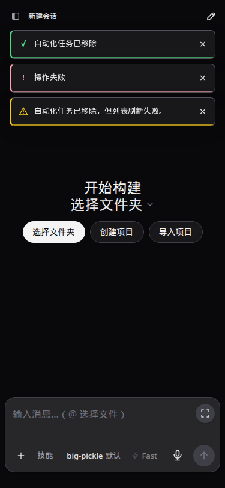
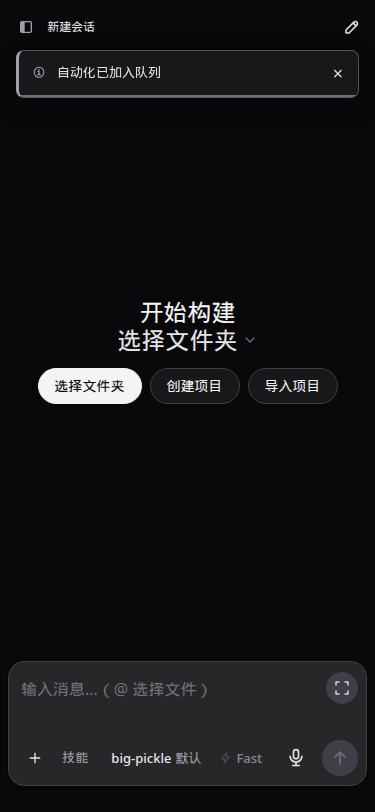
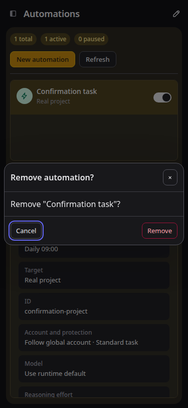

# 封版漏项补查与 0.2.19 交接

本次按用户“再琢磨有没有测试漏项”的要求，核对断言覆盖与异常组合，而非仅重复全量测试。补查后修复空项目折叠，补齐调度存储故障测试及测试脚本独立运行条件。0.2.19 已作为本轮封版提交 GitHub 并 prepare；59001 已更新；封版交付时生产 5900 尚为 0.2.18。随后完成后台终端排查与授权停止；本次文档同步时查验生产也已运行 0.2.19，详见第 7–8 节。本轮 UI 追加及最新发布状态见第 9 节，前面的固定包记录保留为历史。本文接续 0010 需求结账与 0011 四项修复，不把其保留项改写成已修复。

## 1. 本次发现及处置

| 漏项 | 实际影响 | 处置与验证 |
| --- | --- | --- |
| 空项目只测图标，未测内容消失 | 用户发现的空虚拟项目收起后仍显示“没有会话”；同一模板也影响空目录项目 | 先添加断言，原代码稳定失败 `1 !== 0`；空行增加折叠判断。鼠标、Enter、空格，空目录/空组织、有成员组织及刷新恢复均通过；验证真实高度只占标题行 |
| 调度在磁盘写满与重启交界缺少直接断言 | 仅看正常保存/竞争保存不足以证明失败后不会误发、恢复后不会重发 | 增加 3 项 ENOSPC 测试：已确认队列等待执行、提交意图写入前、上游受理后。保存失败停止调度，未放行不发送；已持久化队列重启只执行一次；不确定提交标记中断，重复 requestId 保持原 runId，不自动重发 |
| 公共工作树临时输出目录不存在 | 历史恢复已通过 5 个崩溃检查点，但最后写报告 ENOENT；无法可靠独立重跑 | 两个专项脚本自己创建报告父目录并支持报告路径。修复后真实子进程 SIGKILL 恢复与项目移除后自然调度验证通过 |
| 原生准备集成测试清理未等完同进程写入 | 公共全量首轮 822/823，功能断言通过，清理临时账号目录 ENOTEMPTY | 只调整 fixture：关闭 worker 后等待已排队的元数据写入，再移除目录。单测及两份源码全量复跑通过，产品代码未改 |
| 开发服务器自动刷新干扰 UI 长流程 | 同时编辑测试文件触发 Vite reload，使正在验证的编辑弹窗消失 | 服务日志确认 10:55:15 与 10:55:52 的 page reload；停止编辑后完整重跑通过。安装包 59001 再验证折叠，不依赖 Vite |

折叠修复提交 `862cf76`，只改一处 Vue 显示条件；存储故障测试 `1b3d824`，独立报告脚本 `7125e72`，fixture 清理 `1b8458c`。本次补查未改变账号、API、用量、自动化或调度的运行实现。

## 2. 核心组合覆盖与局限

- 调度准备：迟到额度读取、命名挂起、独占 worker 确认退出后释放、共享不可取消操作继续占用、取消后四槽计数、固定/默认账号及另一账号继续运行，均有现有原生 IPC 或确定性竞争测试；本轮全量包含这些用例。
- 账号/API/激活：前台活动与准备竞争、额度阈值等号、未知额度、出口连接存活、旧凭据 generation、激活迟到清理、drain 失败后恢复、切换/回滚认证保持，均有边界测试；不绕过核心门禁注入真实生产故障。
- 历史与调度：原有幂等、未知提交不重发、归档竞争保存、五个真实崩溃检查点，本轮增加上述磁盘故障与重启断言。项目移除后手动、显式重试、固定原账号自然到点、暂停、同请求防重均通过独立 HTTP/IPC 流程；CLI 哈希与最终产物相同。
- 显示：已确认引导与原生历史迟到、切换/刷新、相同正文不误去重、显示存储满、旧 revision、忽略 POST 超时、旧摘要迟到、新问题不被旧忽略吞掉；活跃暂留/红黄点/阅读/手动忽略由已有单元和浏览器故障回放覆盖。
- 空项目本次新增“元素是否消失、高度是否收缩、刷新后是否保留”的直接断言，补上此前仅看图标的弱验证。

以上不是任意账号、任意操作时序的穷举证明。真实云端成功消费、自然额度耗尽/重置、多日连续运行、真实断电、多年大规模历史、Node 18 全能力、所有操作系统、Windows 已安装 PWA 启动器及手机真实软键盘仍未全部实测。保留 OBS-01 待稳定复现、SEC-01 手动主动预览风险、共享原生不可取消操作等待、双显示存储均失败时无法承诺刷新恢复等边界。详见 0011；没有为消除所有理论风险重构核心。

## 3. 本轮测试结果

| 层次 | 结果 |
| --- | --- |
| 开发源码与实际公开源码 | 各 826/826，121 个文件，零失败、零跳过；包含新增 3 项存储测试，49 组合 provider-resume 矩阵包含在总数内 |
| 聚焦存储与竞争持久化 | 40/40 |
| 项目浏览器 | 完整创建、改名、折叠、归组、刷新、自动化标签与移除回归通过；明暗主题，编辑器 1440/768/375px，自动化边距 6 档宽度 |
| 59001 实际安装包折叠 | 空组织/空目录只保留标题，键盘、鼠标、刷新通过；pageerror=0，未发送回合或切换账号 |
| 真实原生认证 Docker | `codexapp-seal-test:0.2.19`，Codex 0.153.4；4195 无认证 Zen→OpenRouter、4196 畸形认证 Zen、4197 原生 authentication 错误刷新保留，重复 live overlay=0；合成认证不变 |
| 固定包与复装 | 27 个 dist/dist-cli 文件逐字节匹配公开源码构建；78 个依赖的 npm ci 复装版本一致、锁不变，CLI/CJS/真实 PTY 通过 |
| 缓存升级 | 同一浏览器从隔离 0.2.18 到新包，HTML no-store/无 ETag，旧 JS 404，新 hashed 资源 immutable；无 API key 返回 401 |
| 类型/构建/隐私 | Vue 类型检查、前端/CLI 构建通过；公共源码及包扫描通过，历史开发资料、凭据、会话与私有截图未上传 |

准确 CJS 命令：

```bash
node -e "process.argv=['node','codexapp','--help'];require('/home/docker/codexapp-releases/codexapp-0.2.19-d20d9fe539a3-20260913-105947/dist-cli/index.js')"
```

退出 0；真实 PTY 输出 `PREPARED_PTY_OK`。完整参数与结果见证据中的 `prepared-verification.json`；测试脚本和原始日志位于仓库 `output/0219-seal/`。

性能：新增折叠判断是已有响应状态的一次常数判断，不新增请求、遍历、监听或缓存；收起时少一个空行 DOM。首包 852.23KB / gzip 270.61KB，CLI 989.81KB；沿用现有超过 500KB 的块警告，本次没有顺带拆包。未重跑无关的大规模性能测试；上轮有效真实首屏采样仍见 0011。

## 4. 版本、GitHub 与固定包

- GitHub：[0.2.19 发布](https://github.com/ERROR403XD/codexapp/releases/tag/v0.2.19)，[PR #6](https://github.com/ERROR403XD/codexapp/pull/6) 已合入。
- 公开快照提交 `d20d9fe539a3ea037e81b818015043bba6ca4a04`；main/tag 合并提交 `c2a4661bfac12746bd52a8097c96e87685c1de5f`。两棵 Git 文件树完全相同。私有混合开发历史未推送。
- 发布附件 `codexapp-0.2.19.tgz` 与 `SHA256SUMS` 已回下载，校验和及文件字节与本地一致。未发布 npm 同名注册包。
- SHA-256：`01893f892715d26a971a5d8c62ba0e136d31e9cdc41513d36d15e6a74d82cedc`。
- prepare 路径：`/home/docker/codexapp-releases/codexapp-0.2.19-d20d9fe539a3-20260913-105947`。使用实际公共快照构建，归档与 GitHub 附件一致；保留部署依赖锁。
- 59001 已在空闲检查→冻结→再次检查→替换→解除冻结→检查通过后更新，PID 2544578。独立 home 保持原位，没有复制账号/会话进生产。
- 封版交付时 5900 仍是 0.2.18，PID 4010970；本会话未执行生产激活。后续运行状态见第 8 节。

## 5. 切换准备与清理

本轮临时 4173（systemd 临时服务及 PID 807765/807824）、59015、4195–4197 已退出，旧独立 npm 安装目录已移除。容器/临时 home 由脚本清理；公开源码 worktree 与已验证测试镜像保留作复查，无运行请求。59001 保留，5173 未操作。

封版交付时，对上述精确路径运行 check 返回 3：`liveExecutions=1, activeTurns=1, queued=0, pendingApprovals=0, apiConnections=0, apiActiveRequests=0`。旧生产激活接口为 `unsupported`，后台终端为 `skipped-busy`，都没有写成零或已验证。已知临时服务退出不等于生产全局空闲。

交付时提供的检查入口如下；今后需要切换时，在独立终端重新运行并以当时结果为准。本次同步发现生产已是目标包，不表示现在需要重复激活：

```bash
cd /home/Code/codexapp
bash scripts/codexapp-release-switch.sh check /home/docker/codexapp-releases/codexapp-0.2.19-d20d9fe539a3-20260913-105947
```

本轮授权为封版、GitHub、prepare 与切换准备，未执行 activate。真正切换须取得相应授权并在当时通过原有门禁；不得复用本文的历史空闲结果。回退到旧历史格式前，仍需停实例、备份并用新程序离线执行 `automation-history --home <home> --export-legacy`，不能恢复旧 Token 或删除永久防重事实。

## 6. 截图与文档

以下验证 URL 为 `http://127.0.0.1:59001/#/`，1440×1000，均为隔离浏览器的合成项目与会话。左侧两个空项目收起后只占标题行，不显示空行。绝对原图路径：`/home/Code/codexapp/output/playwright/0219-seal-candidate-empty-project-collapse-light.png`、`/home/Code/codexapp/output/playwright/0219-seal-candidate-empty-project-collapse-dark.png`。


[精简证据索引](assets/0.2.19-seal/evidence-index.json)。本文及现行导航、功能/UI/版本/运维页同步至 Obsidian `开发/codexapp/` 并核对字节。两份 0.3 UI 设计稿及素材未改动、未归档或提交。

## 7. 本会话追加：后台终端排查、停止与责任判断

### 已核验的记录与用户授权操作

用户在切换时经常遇到“其他会话已空闲、看不到命令进程，却被后台终端记录阻塞”的现象，要求查清来源和影响。本次原生清单定位到 0.3 总体 UI 设计会话：

| 字段 | 本次观察 |
| --- | --- |
| 所属会话 | `01a09687-bbb7-7c43-a795-826610f8d492`，0.3 总体 UI 设计 |
| 工作目录 | `/home/Code/codexapp` |
| 内部进程标识 | `processId=91609`，不是 Linux PID |
| 命令项 | `call_B8F9w5yKZXJHXdnhS4GasWa4` |
| 命令用途 | 用 node 与 apply_patch 修改 `studio.js`、写入 0.3 设计文档；不归属本轮 0.2 封版测试 |
| 观察状态 | 会话 idle；原生返回 osPid、cpuPercent、rssKb 均为空；按完整 shell 命令搜索未找到匹配进程 |
| 初次独立清单 | 5900：14 个已加载会话，其中 1 个持有后台终端；59001：0 个已加载会话、0 个后台终端 |

用户随后明确授权“先把这个停了吧”。再次查询核对同一 threadId/processId/itemId、cwd 和命令用途后，调用 `POST /codex-api/process-activity/terminate`；应用转发原生 `thread/backgroundTerminals/terminate`，返回 `{ terminated: true, absent: false }`。随后该会话列表为空，再独立枚举两实例：5900、59001 的 backgroundThreads 均为 0。没有停止模型回合、重启服务或批量清理其他会话。

这些是此前查询/停止时的观察，不是本次文档同步重新执行的停止或全局空闲检查。[结构化记录](assets/0.2.19-seal/background-terminal-followup.json)同时区分了此前操作与本次只读服务查验。

### 可以确认的机制与影响

1. 原生 Codex app-server 负责终端记录的生成和生命周期。CodexApp 查询该列表，并提供经过身份核对的停止入口；读取模块没有将已完成命令历史重新登记为后台终端的逻辑，也没有长期缓存已完成查询结果。
2. 本次版本切换脚本将原生非空后台终端列表当作阻塞项。这是保守门禁，不是依据 Linux CPU 或 PID 作出的运行诊断。闲置会话 worker 回收也信任原生列表；账号选择切换则有独立的固定身份/活动检查，不能泛化成所有账号、出口、自动化调度都由这一条记录阻塞。
3. 如果确实仅有残留记录，直接影响是误阻塞切换，部分情况下延后闲置 worker 回收；记录本身不会发起模型调用、消耗模型额度。不能据此推断所有请求都受阻，也没有本轮证据证明它已造成数据破坏或额外消费。

### 未确认的根因与表述修正

**目前没有证据表明“产生残留记录”是 CodexApp 导致的，也没有足够证据将本条记录定性为原生 Codex 的已确认缺陷。**

会话 idle 只说明当前模型回合没有推进；原生后台终端可以独立存在。官方运行中示例允许 `osPid: null`，内部 processId 与 OS PID 不是一回事。[官方后台终端接口](https://learn.chatgpt.com/docs/app-server#clean-background-terminals)

此前“疑似遗留记录”保留为推测；按完整命令搜索不到进程，并不等于已证明所有子进程/后台任务都退出。成功 terminate 及记录消失也不能反向证明此前没有实际工作。

记录由原生管理，只能确定职责归属，不能完全排除 CodexApp 的交互方式间接触发原生异常。尚未在独立原生环境复现“命令和子任务确认退出→列表持续残留”，也未取得覆盖全过程的退出/登记轨迹，因此不能将责任直接归到任一侧。

### 本次处置边界与后续诊断

该条记录已经按用户授权停止；没有修改产品代码、切换脚本或账号/调度规则，不把本次清理写成产品缺陷修复。下次复现应在停止前保留必要的退出与终端元数据，核对原生版本和实际执行后端，必要时在独立原生实例复现，避免仅凭空 PID 定责。

维持用户核心原则：不能为了消除误阻塞，自动忽略所有 `osPid=null` 的记录，或凭会话 idle/零 CPU 强制终止命令、提前释放资源。明确确认目标后，才按相应授权使用原有停止入口。

## 8. 文档同步时查验到的生产切换状态

2026-09-13 11:32:28（上海时间）只读查验：生产 `codexapp.service` 已于 11:28:27 启动为 PID 2623228，实际进程命令使用 `/home/docker/codexapp-releases/codexapp-0.2.19-d20d9fe539a3-20260913-105947/dist-cli/index.js`。生产 5900 与候选 59001 的能力接口均返回 0.2.19；候选 PID 仍为 2544578。

这是在本次文档更新中发现的后续状态；本次仅读取 systemd、进程命令与版本接口，没有执行 activate、重启、账号切换或调整配置。前面的“尚未切换生产”与 check 返回 3 属于更早封版交付时刻，保留为历史记录。服务版本查验不等于切换全过程或生产真实请求的重新验收，也不是未来切换的空闲凭证。


## 9. 本轮最终 UI 追加、通知整理与交接

### 已完成的用户要求

| 要求 | 实现及直接验证 |
| --- | --- |
| 项目全层级展开/折叠 | 三个点右侧总开关，标题三个点与项目三个点对齐；鼠标/Enter/Space、混合项目、空项目、超过 10 条已加载会话、搜索/时间排序边界、刷新折叠恢复通过 |
| 项目菜单/删除悬停 | 明暗 token 高亮与键盘焦点；1440/768/375px 验证 |
| 图标是否撑高 | 对比前后实测标题 32px、项目 28px、按钮 20px/图标 16px；移除按钮也不改变行高 |
| 仅名称项目新会话闪入无项目区 | 创建回执确认后前端直接归入目标项目，挂起发送、成功/失败、切换与刷新通过；实际 cwd、原生发送参数与一次创建/发送不变 |
| 移除自动化/清除目标确认 | 详情、编辑器、普通项目连带任务移除覆盖；取消/默认焦点/Esc 无请求，忙碌防重，失败重试，目标被外部修改时拒绝误清除 |
| 细分动作通知 | 移除/启用/暂停不再被上层“自动化已更新”覆盖；连接切换不再称账号切换；写入完成与列表刷新失败分开表达 |
| 扩展通知颜色但不加噪声 | 只对现有提示分类，绿色成功/红色失败/黄色注意/灰色信息。详情“立即运行”新增提示在用户澄清后撤掉，最终仍保持安静；编辑器已有入队提示仅改灰色。详见 0014 |

本轮代码提交（内部）`77108e8`、`31048fb`、`bf8a0b1`、`9a3a838`；公开对应 `204616a`、`9d9c47a`、`e070fb2`、`b1d2645`。PR #8/#9/#10 均已合并。此前两次中间候选 204616a、e070fb2 已被本节最终候选替代，不应再拿中间路径切换。

### 测试与影响评估

- 最终开发与公开源码各 **830/830、121 文件**，类型检查/前后端构建通过；含账号/调度/API/投递/历史已有核心回归及新增即时归组、通知生命周期用例。
- 4173 四类真实通知组件：中英文标签、浅深主题、1440×1000 / 768×1024 / 375×812、倒计时、阅读暂停、键盘关闭；额度合成回执 5 次请求均保持原 ID/确认/幂等字段。技能无结果中性提示仅 1 次查询。
- 最终 59001 安装包：确认完整流程、黄色刷新问题、编辑器中性入队、详情静默、项目树和即时归组均通过。颜色不是额外业务状态，不改变账号或额度操作。
- 最终打包认证矩阵 `codexapp-notice-test:0.2.19`：4195 无认证 Zen→OpenRouter、4196 畸形认证回落 Zen、4197 原生认证失败刷新保留、重复 live overlay=0。合成认证不变；真实云端成功消费未验证。
- 固定包 27 个 dist/dist-cli 文件与公开源码构建一致；78 项 npm ci 复装、锁一致、CLI help、CJS 加载与真实 PTY `PREPARED_PTY_OK` 通过。同浏览器由此前 0.2.19 升级：HTML no-store/无 ETag，旧资源 404，新 hash 资源 immutable；API 无 key 仍为 401。
- **后端 CLI 与生产包逐字节相同**，SHA-256 `13a3d39d3fae93a94ebf079948a6ea3fd31066ddee96a016022835fc08063e05`。本轮 UI 修改没有变动账号切换、用量、API、自动化出口、调度或互相阻塞放行的实现，也没有结构重构。

性能：项目总开关只遍历已加载项目 O(P)，展开已有行不会请求更多历史；即时归组为常数判断，不加请求/等待/缓存。确认取消 0 请求，确认单次原操作；通知仍最多 3 条/3 个计时器，未加轮询或通知中心。最终首包 856.60KB / gzip 271.80KB，CLI 989.81KB；相较初次封版 852.23KB，增加来自本轮 UI。未测多年历史或调度延迟，不将代码路径审查等同真实云端负载测试。

补充观察与处置：扩展项目树 fixture 时发现快速加载下置顶在刷新后从内存列表消失；在修改前的 59001 204616a 和开发版本均重现，置顶代码本轮未改。暂记为既有 hydration 时序观察，尚未在用户真实数据上确证，不混入本轮核心或结构修复。项目总开关对置顶/无项目分区的独立性与折叠刷新恢复分别验证，不把失败的置顶刷新诊断写成通过。原始诊断保留在 output/0219-tree-toggle/pin-old.json 与 output/0219-project-immediate/tree-ui.json。

### 最终发布与切换准备

- [GitHub v0.2.19](https://github.com/ERROR403XD/codexapp/releases/tag/v0.2.19) tag/main：`875b0319654a326889140b013270bf51b5a1429b`；实际公开构建提交 `b1d26454703c`，文件树一致。保持用户精简发布正文，下载附件与本地产物逐字节验证。
- 最终 tarball SHA-256：`f0aa77a6149cd824eec6f760979670b75c0fd0154ce29b0e52f5895961d14577`。
- 最终 prepare：`/home/docker/codexapp-releases/codexapp-0.2.19-b1d26454703c-20260913-123958`；59001 PID 2972162，独立原 home，不导入生产认证或会话。
- 5900 PID **2623228** 未变，继续运行此前 d20d9fe 包；本轮没有 activate。临时 4173、59015、4195–4197 已停止/清理，4173 来自本次 transient systemd 单元，无原生后台终端启动器。
- 精确路径 check 返回 **3**；活跃回合仍存在，后台检查 **skipped-busy**，不是 0。已清理已知验证进程，不终止其他会话或放宽门禁。结束工作后从独立终端重新执行：

```bash
cd /home/Code/codexapp
bash scripts/codexapp-release-switch.sh check /home/docker/codexapp-releases/codexapp-0.2.19-b1d26454703c-20260913-123958
```

CJS 命令（退出 0）：`node -e "process.argv=['node','codexapp','--help'];require('/home/docker/codexapp-releases/codexapp-0.2.19-b1d26454703c-20260913-123958/dist-cli/index.js')"`。prepare 不是激活授权，也不代表后续必然空闲。

### 截图与文档

通知组件 URL `http://127.0.0.1:4173/#/`；最终候选确认 URL `http://127.0.0.1:59001/#/automations`，项目树/即时归组为 `http://127.0.0.1:59001/#/`。浅深主题三档视口均通过；以下为 375×812 中文通知和最终安装包确认。绝对截图前缀 `/home/Code/codexapp/output/playwright/`，文件名与下方链接一致。





[本轮精简证据索引](assets/0.2.19-final-ui/evidence-index.json)。现行版本、架构、功能、UI、运维、导航、交接及 0014 通知清单同步 Obsidian `开发/codexapp/` 并核对内容。两份 0.3 设计稿、素材和他人发布说明页均未改动。
